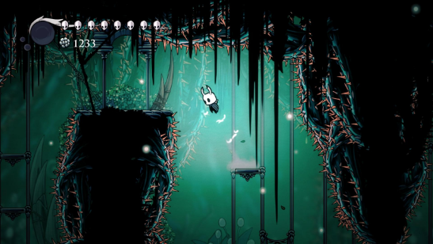
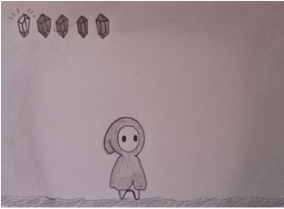
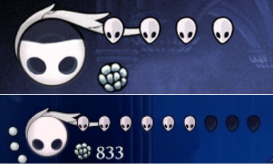
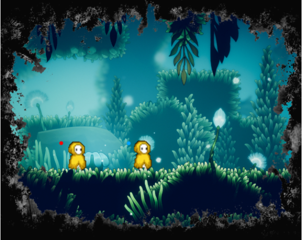
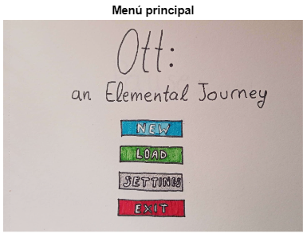
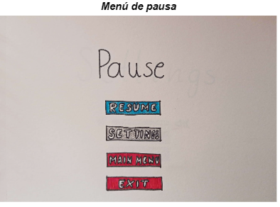
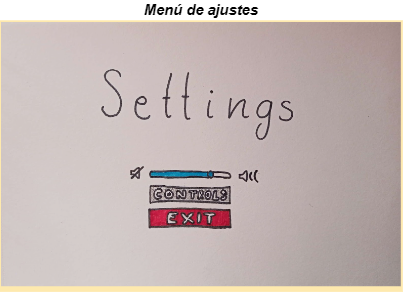

# **Ott: an Elemental Journey - Game Design Document**
- [**Ott: an Elemental Journey - Game Design Document**](#ott-an-elemental-journey---game-design-document)
  - [**1 - Ficha técnica**](#1---ficha-técnica)
  - [**2 - Descripción**](#2---descripción)
  - [**3 - Jugabilidad**](#3---jugabilidad)
    - [**Mecánicas de Ott**](#mecánicas-de-ott)
    - [**Elementos**](#elementos)
    - [**Ataque**](#ataque)
    - [**Defensa**](#defensa)
    - [**Sistema de vida**](#sistema-de-vida)
    - [**Mapa**](#mapa)
    - [**Mecánicas de escenario**](#mecánicas-de-escenario)
  - [**4 - Diseño de nivel**](#4---diseño-de-nivel)
  - [**5 - HUD**](#5---hud)
  - [**6 - Visual**](#6---visual)
  - [**7 - Menús y flujo de juego**](#7---menús-y-flujo-de-juego)
  - [**8 - Contenido**](#8---contenido)
    - [**Personajes y enemigos**](#personajes-y-enemigos)
  - [**9 - Referencias**](#9---referencias)

## **1 - Ficha técnica**
- **Título**: *Ott: an Elemental Journey*
- **Género**: Metroidvania
- **Target**: Jugadores no noveles exploradores
- **Rating**: PEGI 7
- **Plataforma**: PC (Windows/Mac)
- **Modos de juego**: 
  - Un jugador: Campaña.
  
## **2 - Descripción**
Ott, el protagonista, tiene por destino salvar al mundo de la oscuridad que lo asola. Viajará por tres regiones diferenciadas por las fuerzas de la naturaleza que ejercen sus dominios sobre ellas: El Reino del Fuego, del Agua y de la Tierra. En estos lugares, Ott se encontrará con habitantes corruptos por la oscuridad que tratarán de evitar que cumpla su sino. Durante sus viajes conseguirá dominar los diferentes elementos para derrocar al mal de su tierra natal. Estos elementos le proporcionarán nuevas habilidades con las que explorar zonas antes cerradas para elle, permitiéndole volver atrás en sus pasos y descubrir pequeños secretos que estas tierras ocultan.

## **3 - Jugabilidad**
### **Mecánicas de Ott**

<table>
    <tr>
        <th>Input teclado || Mando PS || Mando XBOX</th>
        <th>Descripción</th>
    </tr>
    <tr>
        <td>A / D || Mover joystick izquierdo|| Mover joystick izquierdo</td>
        <td><b>Desplazamiento izquierda o derecha</b>. Velocidad constante.
        También se permite movimiento durante el salto a una velocidad reducida.
        </td>
    </tr>
    <tr>
        <td>W || X || A</td>
        <td><b>Salto</b>: impulso vertical a velocidad constante. No podrá volver a saltar hasta apoyarse en una superficie sólida. También se consigue llegar más alto al estar sumergido
        </td>
    </tr>
     <tr>
        <td>Flechas teclado || R1, R2, L1, L2 || RB, RT, LB, LT</td>
        <td><b>Cambio de elemento</b>. Ott será de luz de forma predeterminada, pero adquirirá hasta otros tres elementos: Agua, Fuego y Tierra. No se podrá cambiar de elemento instantáneamente después de haber cambiado al actual: habrá un pequeño <i>cooldown</i>. 
        </td>
    </tr>
    <tr>
        <td>Espacio || Cuadrado || X</td>
        <td><b>Ataque</b>: Ott realiza un ataque a melee que daña a los enemigos que alcance y los empuja ligeramente en la dirección contraria con la que se acercaron a Ott. También será capaz de romper obstáculos en su camino. Es rápido, no requiere un tiempo de carga (aunque no puedes realizar un ataque si ya se está ejecutando otro) y puede realizarse tantas veces como se quiera.  Puedes moverte y atacar a la vez.   La efectividad del ataque contra los enemigos depende del elemento de Ott. 
        </td>
    </tr>
    <tr>
        <td>Shift || Círculo || B</td>
        <td><b>Defensa</b>: Ott tiene un escudo con el que puede defenderse para tratar de anular el daño recibido por los ataques enemigos. El escudo depende del elemento que se esté usando en ese momento (ver <b>Defensa</b> más abajo). 
        </td>
    </tr>
    <tr>
        <td>E || Triángulo || Y  cerca de una <b>Lámpara de Teletransporte</b> con el elemento <b>Luz</b></td>
        <td><b>Teletransporte entre lámparas</b>: Véase <a href="#mecánicas-de-escenario"><b>Elementos Interactuables</b></a>
        </td>
    </tr>
    <tr>
        <td>E || Triángulo || Y</td>
        <td><b>Interactuar con objetos</b>
        </td>
    </tr>
    <tr>
        <td>Tabulador || Botón Share || Botón Vista</td>
        <td><b>Mapa</b>: Ott accederá al mapa y podrá consultar su ubicación actual y qué ha descubierto hasta ahora 
        (ver <a href="#mapa"><b>Mapa</b></a> más adelante).
        </td>
    </tr>
</table>

### **Elementos**

### **Ataque**
<table>
    <tr>
        <th>Elemento</th>
        <th>Ataque normal</th>
        <th>Habilidad</th>
    </tr>
    <tr>
        <td>Luz</td>
        <td>Ataque básico</td>
        <td><b>Teletransporte</b> entre determinados focos de luz del mundo</td>
    </tr>
    <tr>
        <td>Agua</td>
        <td><b>Chorro de agua</b> (de más rango que el básico, pero con menor daño)</td>
        <td><b>Buceo</b>: sustituye al movimiento básico de Ott al estar bajo el agua.</td>
    </tr>
    <tr>
        <td>Fuego</td>
        <td><b>Bolas de fuego</b></td>
        <td><b>Quemar</b> raíces/hielo del fuego</td>
    </tr>
    <tr>
        <td>Tierra</td>
        <td><b>Enredadera</b> (se lanza una enredadera como posible ataque (<b>látigo</b>), si esta encuentra un enemigo, causa daño, si encuentra una zona de hierba, planta una enredadera vertical)</td>
        <td><b>Enredadera</b> (plantada en el suelo, puede <b>escalarse</b> cuando es puesta en zonas de hierba)</td>
    </tr>
</table>

### **Defensa**
Como se menciona anteriormente, Ott es capaz de usar un escudo que le permitirá mitigar completamente el daño que vaya a recibir. Este método de defensa tiene 3 formas de actuar según el elemento que haya atacado a Ott respecto al elemento escogido actualmente:
- **Elemento débil**: Si Ott ha bloqueado un ataque a *melee*, el atacante será *stunneado* X tiempo. En caso de haber parado un proyectil, este será devuelto en su dirección contraria.
- **Elemento neutro**: Ningún efecto añadido.
- **Elemento fuerte**: Ott queda *stunneado* durante X tiempo.
### **Sistema de vida**
Ott empieza con 5 puntos de vida que puede perder cuando recibe un ataque de un enemigo, si entra en contacto con algún enemigo o con algún elemento del dañino entorno (pinchos, zarzas, cristales…). Si en algún momento el valor de vida llega a 0, Ott morirá y volverá a aparecer en el **Punto de Teletransporte** más cercano, haciendo que los enemigos que haya vencido durante su última vida reaparezcan. También recuperará sus puntos de vida.
### **Mapa**
A medida que Ott atraviesa las diferentes salas que conforman el mundo, el pequeño las irá dibujando de una forma esquemática en un mapa. Este mapa será accesible en cualquier momento por el jugador, aunque no parará el flujo del juego: lo demás sigue en movimiento. El mapa también es capaz de registrar constantemente la posición de Ott durante su recorrido. Los Santuarios aparecen marcados en el mapa.  
Véase [**HUD**](#5---hud) para la representación del mapa.
### **Mecánicas de escenario**
<table>
    <tr>
        <td><b>Zona de hierba</b></td>
        <td>Habilitan la creación de <b>enredaderas</b> sobre ellas usando el poder elemental de tierra/planta</td>
    </tr>
    <tr>
        <td><b>Enredaderas</b></td>
        <td>Hojas dispuestas verticalmente; permiten a Ott <b>subir por ellas</b>.</td>
    </tr>
    <tr>
        <td><b>Raíces/Hielo</b></td>
        <td><b>Bloquean</b> el camino. Pueden <b>romperse</b> usando el poder elemental del <b>fuego</b></td>
    </tr>
    <tr>
        <td><b>Zonas profundas de agua</b></td>
        <td>Habrá que pasar por ellas <b>buceando</b> con el poder del agua. Al usarlo, el personaje es capaz de llegar hasta el fondo del agua, pudiendo caminar por él. Su salto y movimiento se verán ligeramente ralentizados. Al cambiar de elemento bajo el agua, el personaje ascenderá lentamente. Si se usa el fuego, el personaje sufrirá daño constantemente.</td>
    </tr>
    <tr>
        <td><b>Lámparas de teletransporte</b></td>
        <td>Siempre son 2 lámparas que están relacionadas: Funcionan de forma similar a las <b>Tuberías</b> de <i>Mario Bros</i>, donde puedes interactuar con cualquiera de los dos extremos y este moverá a tu personaje al otro extremo. Solo se puede interactuar con ellas estando en el elemento de Luz.</td>
    </tr>
    <tr>
        <td><b>Santuarios</b></td>
        <td><b>Referencia</b> rápida: Bancos de <i>Hollow Knight</i>; Hogueras de <i>Dark Souls</i> y similares. 
        Actúan como <b>zonas de descanso</b> y <b>puntos de guardado</b> para el jugador. Serán su punto de <b>reaparición</b> al morir y al volver a cargar una partida. Al interactuar con ellos puedes <b>recuperar</b> completamente tus <b>puntos de vida</b>, haciendo que los <b>enemigos</b> a tu alrededor <b>reaparezcan</b> si habían sido derrotados y guardando la partida; o simplemente guardar la partida.</td>
    </tr>
</table>

## **4 - Diseño de nivel**
Por el momento, el diseño está fuertemente inspirado en grandes obras del género como *Hollow Knight*. En estos juegos el diseño gira entorno al plataformeo y al movimiento del personaje por las ‘salas’, formadas por múltiples plataformas de diferentes tipos, aparte de caminos en un primer lugar bloqueados o inaccesibles debido a la falta de habilidades del personaje que controlamos, y, generalmente, también destaca la presencia de enemigos, que a medida que se avanza en el juego, se vuelven más fuertes.

## **5 - HUD**

La interfaz ocupará el menor espacio posible en pantalla, ya que la información acerca del estado del jugador se presentará de forma diegética (integrada en el mundo). El color de la capa de Ott y los diferentes decorados que esta tenga dependerán del elemento que el pequeño esté usando en ese momento. Por otro lado, la vida tendrá una representación ‘doble’: Mediante una ‘barra de vida’ que toma valores discretos (**Figura 1**) y oscureciendo la pantalla ligeramente: cuanta menor sea la vida, mayor será el oscurecimiento (**Figura 2**).

**Figura 1**: Referencia tomada de *Hollow Knight*. Se aprecia una ‘Barra de vida’ formada por 4 máscaras, que representan cada uno de los puntos de vida del jugador. Cuando una de estas máscaras falta, implica que el jugador ha perdido ese punto de vida.  

**Figura 2**: Boceto de cómo se vería el oscurecimiento de pantalla si Ott tuviera un valor muy bajo de vida

## **6 - Visual**
La estética del juego será Pixel Art 2D. El juego está ambientado en un mundo fantástico basado en tres elementos. Aun teniendo motivos bélicos, la parte visual no destacará por la alusión al terror o pesadilla. Será una estética suave, atrayente y colorida, que sugerirá el mundo fantástico que creamos. 
En el reino del agua predominarán los elementos marinos, representados mediante una paleta de azules y verdes azulados. En el reino del fuego, colores intensos rojos que dibujarán las llamas y otros elementos como la lava. En el reino de tierra, invadirá la naturaleza con árboles, flores y enredaderas. Observaremos una gran cantidad de verde, con detalles de más variedad de colores (rosas, amarillos…)  
El personaje principal, **Ott**, en su estado inicial/base será un ser de luz con detalles de vestimenta para resaltar su forma. Irá incorporando nuevos elementos y con estos cambiará su skin.  
El **boss final** es un ser de oscuridad, antagonista a Ott, por lo que se conformará por una paleta oscura de negros y violetas.   
Los personajes de cada elemento portarán los colores de su reino, integrándose en él, excepto aquellos infectados por la oscuridad, nuestros **enemigos**, que incorporarán partes del cuerpo **afectadas con los colores del antagonista**.

**Las paletas de cada zona serán las siguientes:**

## **7 - Menús y flujo de juego**
El juego contará con un menú principal donde poder crear una **partida nueva**, **cargar partida**, **acceder a ajustes** o **salir** de la aplicación. 
Al acceder al submenú de ajustes se podrán encontrar mayoritariamente ajustes de sonido.

Una vez se haya accedido a una partida, el juego podrá **pausarse** pulsando la tecla ESC || Botón Options || Botón Start. Esto hará que toda la ejecución del juego, excepto la música, se detenga. En este menú podremos entrar a **ajustes**, **salir al menú** o **salir al escritorio**. Si se escoge cualquier opción de salida, se preguntará al usuario si quiere **guardar o no partida**, pidiendo también una **confirmación** para **no guardar**. Después de esto, se saldrá al menú/escritorio. Independientemente de dónde guarde el jugador, Ott reaparecerá en el último Santuario visitado

## **8 - Contenido**
### **Personajes y enemigos**
Cada zona del juego (Bosque, Lago - Fondo del lago, Volcán y Oscuridad) tendrán 3 tipos de enemigos (débil, medio y fuerte) descrito más adelante. De esta forma, el enemigo débil del bosque no será el mismo que el del Volcán, por ejemplo.
<table>
    <tr>
        <td><b>Ott</b></td>
        <td>Avatar del jugador. Ser de luz que va incorporando distintos elementos</td>
    </tr>
    <tr>
        <td><b>Mariposas</b></td>
        <td>Seres que contienen el poder de los elementos y siguen a Ott en su camino, cediendole el poder de cada elemento cuando lo solicite</td>
    </tr>
    <tr>
        <td><b>Boss</b></td>
        <td>Antagonista, ser de oscuridad que también puede poseer los distintos elementos y hacer uso de ellos</td>
    </tr>
    <tr>
        <td><b>Enemigo débil</b></td>
        <td>Tienen poca vida; resisten poco daño. Su tamaño es reducido.</td>
    </tr>
    <tr>
        <td><b>Enemigo medio</b></td>
        <td>Su vida es superior al enemigo débil; aguantan más los golpes. Tamaño similar a Ott.</td>
    </tr>
    <tr>
        <td><b>Enemigo fuerte</b></td>
        <td>Enemigos de gran tamaño y resistencia al daño; aguantan aún más los golpes. Superan con creces el tamaño de Ott. </td>
    </tr>
</table>

Los tres tipos de enemigos serán habitantes de cada reino infectados por la oscuridad. Cada uno de ellos es de un elemento concreto , lo que hará que los ataques y defensas de Ott sean más efectivos según qué elemento porte (véase [**Elementos**](#elementos)).
## **9 - Referencias**
 - **Historia**: *The Legend of Zelda: Breath of the Wild*, *Hollow Knight*
 - **Género**: *CastleVania*, *Hollow Knight*
