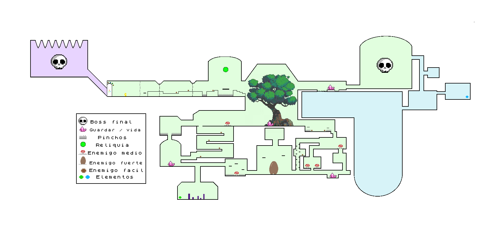
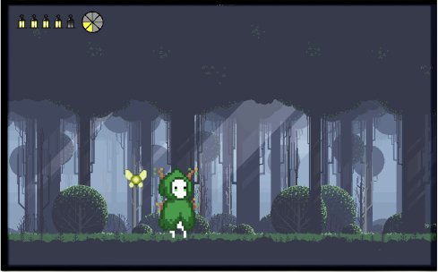

# **Ott: an Elemental Journey - Game Design Document**
- [**Ott: an Elemental Journey - Game Design Document**](#ott-an-elemental-journey---game-design-document)
  - [**1 - Ficha técnica**](#1---ficha-técnica)
  - [**2 - Descripción**](#2---descripción)
  - [**3 - Jugabilidad**](#3---jugabilidad)
    - [**3.1 - Elementos**](#31---elementos)
    - [**3.2 - Mecánicas de Ott**](#32---mecánicas-de-ott)
    - [**3.3 - Ataque**](#33---ataque)
    - [**3.4 - Defensa**](#34---defensa)
    - [**3.5 - Sistema de vida**](#35---sistema-de-vida)
    - [**3.6 - Mapa**](#36---mapa)
    - [**3.7 - Mecánicas de escenario**](#37---mecánicas-de-escenario)
    - [**3.8 - Cámara**](#38---cámara)
  - [**4 - Diseño de nivel**](#4---diseño-de-nivel)
    - [Bosque](#bosque)
  - [**5 - HUD**](#5---hud)
  - [**6 - Visual**](#6---visual)
  - [**7 - Menús y flujo de juego**](#7---menús-y-flujo-de-juego)
  - [**8 - Contenido**](#8---contenido)
    - [**Personajes y enemigos**](#personajes-y-enemigos)
  - [**9 - Referencias**](#9---referencias)

## **1 - Ficha técnica**
- **Título**: *Ott: an Elemental Journey*
- **Género**: Metroidvania
- **Target**: Jugadores no noveles exploradores
- **Rating**: PEGI 7
- **Plataforma**: PC (Windows/Mac)
- **Modos de juego**: 
  - Un jugador: Campaña.
  
## **2 - Descripción**
Ott, el protagonista, tiene por destino salvar al mundo de la oscuridad que lo asola. Viajará por tres regiones diferenciadas por las fuerzas de la naturaleza que ejercen sus dominios sobre ellas: El Reino del Fuego, del Agua y de la Tierra. En estos lugares, Ott se encontrará con habitantes corruptos por la oscuridad que tratarán de evitar que cumpla su sino. Durante sus viajes conseguirá dominar los diferentes elementos para derrocar al mal de su tierra natal. Estos elementos le proporcionarán nuevas habilidades con las que explorar zonas antes cerradas para elle, permitiéndole volver atrás en sus pasos y descubrir pequeños secretos que estas tierras ocultan.

## **3 - Jugabilidad**
### **3.1 - Elementos**

El elemento básico que incluye el personaje es luz, a lo largo del juego podrás conseguir el resto de elementos, cada uno en su reino correspondiente, exceptuando la oscuridad, que es la representación del enemigo y superior en fuerza al resto de elementos (no ante luz) tal y como se muestra en el diagrama.

### **3.2 - Mecánicas de Ott**

<table>
    <tr>
        <th>Input</th>
        <th>Acción</th>
    </tr>
    <tr>
        <td>A / D (teclado)   Mover joystick izquierdo (PS y XBOX)</td>
        <td><b>Desplazamiento izquierda o derecha</b>. Velocidad constante.
        También se permite movimiento durante el salto a una velocidad reducida.
        </td>
    </tr>
    <tr>
        <td>W (teclado)   X (PS)   A (XBOX)</td>
        <td><b>Salto</b>: impulso vertical a velocidad constante. No podrá volver a saltar hasta apoyarse en una superficie sólida. Al estar sumergido en agua se salta más alto.
        </td>
    </tr>
     <tr>
        <td>Flechas teclado   R1, R2, L1, L2 (PS)   RB, RT, LB, LT (XBOX)</td>
        <td><b>Cambio de elemento</b>. No se podrá cambiar de elemento instantáneamente después de haber cambiado al actual (habrá un pequeño <i>cooldown</i>). 
        </td>
    </tr>
    <tr>
        <td>Espacio (teclado)   Cuadrado (PS)   X (XBOX)</td>
        <td><b>Ataque</b>:
            <ul>
                <li>Todos los ataques empujan ligeramente a los enemigos hacia atrás. No requiere tiempo de carga.</li>
                <li>No hay límite de ataques.</li>
                <li>Puedes realizar un ataque y moverte a la vez.</li>
                <li> La efectividad del ataque contra los enemigos depende del elemento de Ott.</li>
            </ul>
        </td>
    </tr>
    <tr>
        <td><b>MANTENER</b>  Espacio (teclado)   Cuadrado (PS)   X (XBOX)</td>
        <td><b>Ataque cargado</b>: Ott podrá realizarlo si el indicador de “<i>Ataque Cargado</i>” está completamente lleno (matando enemigos). Se quedará quieto el tiempo de duración del ataque.</td>
    </tr>
    <tr>
        <td>Shift (teclado)   Círculo (PS)   B (XBOX)</td>
        <td><b>Defensa</b>: Ott dispone de un escudo para defenderse (ver <a href="#34---defensa"><b><i>Defensa</i></b></a>).</td>
    </tr>
    <tr>
        <td>E (teclado)  Triángulo (PS)   Y (XBOX)</td>
        <td><b>Interactuar con objetos</b>: ver <a href="#37---mecánicas-de-escenario"><b><i>Mecánicas de escenario</i></b></a>
        </td>
    </tr>
    <tr>
        <td>Tabulador (teclado)   Botón Share (PS)   Botón Vista (XBOX)</td>
        <td><b>Mapa</b>: se podrá consultar la ubicación actual y salas descubiertas (ver <a href="#36---mapa"><b><i>Mapa</i></b></a> más adelante).
        </td>
    </tr>
</table>

### **3.3 - Ataque**
<table>
    <tr>
        <th>Elemento</th>
        <th>Ataque normal</th>
        <th>Ataque cargado</th>
        <th>Habilidad</th>
    </tr>
    <tr>
        <td>Luz</td>
        <td>Ataque básico   </td>
        <td>Igual que el básico pero con doble de daño, un mayor rango y los enemigos se ven empujados más distancia</td>
        <td><b>Teletransporte</b> entre determinados focos de luz del mundo</td>
    </tr>
    <tr>
        <td>Agua</td>
        <td><b>Chorro de agua</b> (de más rango que el básico, pero con menor daño)      El rectángulo representa el ataque. Dura X tiempo y tiene una serie de ‘ticks’. Cada vez que se da un tick y un enemigo está en el rango del ataque, este sufrirá daño. El ataque se mueve junto al jugador. No atraviesa al primer enemigo.</td>
        <td>Igual que el básico pero con más duración y rango. También puede atravesar enemigos. (por lo tanto, más ‘ticks’).</td>
        <td><b>Buceo</b>: sustituye al movimiento básico de Ott al estar bajo el agua.</td>
    </tr>
    <tr>
        <td>Fuego</td>
        <td><b>Bola de fuego</b>: hace daño en área. Tiene un corto rango (más que melee, menos que chorro de agua)</td>
        <td><b>Bolas de fuego</b>: igual que la bola de fuego normal, pero se lanzan tres seguidas.</td>
        <td><b>Quemar</b> objetos</td>
    </tr>
    <tr>
        <td>Tierra</td>
        <td><b>Látigo</b> de medio alcance hacia una dirección.</td>
        <td>Látigo que se tira en ambos lados, creando daño en el área delimitada por su alcance.</td>
        <td><b>Enredadera</b>: puede escalarse y crece verticalmente cuando interactúa con las zonas de hierba.</td>
    </tr>
</table>

### **3.4 - Defensa**
Ott es capaz de usar un escudo que le permitirá mitigar completamente el daño que vaya a recibir. Cuando tiene el escudo en alto su velocidad de movimiento se ve bastante reducida. Este método de defensa tiene 3 formas de actuar según el elemento que haya atacado a Ott respecto al elemento escogido actualmente:
- **Elemento débil**: Si Ott ha bloqueado un ataque a *melee*, el atacante será *stunneado* X tiempo.
- **Elemento neutro**: Ningún efecto añadido.
- **Elemento fuerte**: Ott queda *stunneado* durante X tiempo.

Todos los proyectiles que golpeen el escudo se destruyen.

### **3.5 - Sistema de vida**
Se empezará con 5 puntos de vida que puede perder cuando recibe un ataque de un enemigo, si entra en contacto con algún enemigo o con algún elemento del dañino entorno (pinchos, zarzas, cristales…).   

Si en algún momento el valor de vida llega a 0, Ott morirá y volverá a aparecer en el último **Punto de Teletransporte** que atravesará, haciendo que los enemigos que haya vencido durante su última vida reaparezcan.  
El máximo de puntos de vida puede ser ampliado mediante fragmentos de vida, que podrán obtenerse mediante:
  - Exploración, encontrando ocultos por el mundo.
  - Al terminar un nivel/sección.
  - Al adquirir una reliquia oculta en una zona y llevándola a su pedestal correspondiente. (las reliquias se muestran en el HUD)

Al obtener 3 de estos, la vida máxima de Ott aumenta en 1 permanentemente.
(Véase [***HUD***](#5---hud) para la representación de este sistema).

### **3.6 - Mapa**
A medida que Ott atraviesa las diferentes salas que conforman el mundo, el pequeño las irá dibujando de una forma esquemática en un mapa, los Santuarios que hayan sido descubiertos aparecen marcados en el mapa. Este mapa será accesible en cualquier momento por el jugador, aunque no parará el flujo del juego: lo demás sigue en movimiento.

El mapa también es capaz de registrar constantemente la posición de Ott durante su recorrido. Véase [***HUD***](#5---hud) para la representación del mapa.

### **3.7 - Mecánicas de escenario**
<table>
    <tr>
        <td><b>Zona de hierba</b></td>
        <td>Habilitan la creación de <b>enredaderas</b> sobre ellas usando el poder elemental de tierra/planta</td>
    </tr>
    <tr>
        <td><b>Enredaderas</b></td>
        <td>Hojas dispuestas verticalmente; permiten a Ott <b>subir por ellas</b>.</td>
    </tr>
    <tr>
        <td><b>Raíces/Hielo</b></td>
        <td><b>Bloquean</b> el camino. Pueden <b>romperse</b> usando el poder elemental del <b>fuego</b></td>
    </tr>
    <tr>
        <td><b>Zonas profundas de agua</b></td>
        <td>Habrá que pasar por ellas <b>buceando</b> con el poder del agua. Al usarlo, el personaje es capaz de llegar hasta el fondo del agua, pudiendo caminar por él. Su salto y movimiento se verán ligeramente ralentizados. Al cambiar de elemento bajo el agua, el personaje ascenderá lentamente. Si se usa el fuego, el personaje sufrirá daño constantemente.</td>
    </tr>
    <tr>
        <td><b>Lámparas de teletransporte</b></td>
        <td>Siempre son 2 lámparas que están relacionadas: Funcionan de forma similar a las <b>Tuberías</b> de <i>Mario Bros</i>, donde puedes interactuar con cualquiera de los dos extremos y este moverá a tu personaje al otro extremo.</td>
    </tr>
    <tr>
        <td><b>Santuarios</b></td>
        <td><b>Referencia</b> rápida: Bancos de <i>Hollow Knight</i>; Hogueras de <i>Dark Souls</i> y similares. 
        Actúan como <b>zonas de descanso</b> y <b>puntos de guardado</b> para el jugador. Serán su punto de <b>reaparición</b> al morir y al volver a cargar una partida. Al interactuar con ellos puedes <b>recuperar</b> completamente tus <b>puntos de vida</b>, haciendo que los <b>enemigos</b> a tu alrededor <b>reaparezcan</b> si habían sido derrotados y guardando la partida; o simplemente guardar la partida.</td>
    </tr>
</table>

### **3.8 - Cámara**
La cámara sigue al jugador, manteniéndolo en el centro en todo momento excepto al llegar al borde de una sala, momento en que los bordes de la sala coincidirían con el borde de la cámara, causando que el jugador deje de estar en el centro. Cuando se pase de una sala a otra la cámara hace un scroll rápido hacia la sala destino.

## **4 - Diseño de nivel**
El diseño gira entorno al plataformeo y al movimiento del personaje por las ‘salas’, que contienen múltiples plataformas de diferentes tipos, aparte de caminos en un primer lugar bloqueados o inaccesibles debido a la falta de habilidades del personaje que controlamos; y también destaca la presencia múltiples en enemigos.  
Todos los reinos cuentan con los siguientes puntos en común:
  - **Tres tipos de enemigos** que no se comparten entre los reinos.
  - Un **elemento** guardado por enemigos de oscuridad.
  - Un **Boss final** que nos dará un fragmento de vida.
  - Un **fragmento de vida oculto** en alguna sala
  - Una **reliquia** única.
  - Una **sala a oscuras**, donde solo se puede ver si se lleva el **elemento de luz**. En esta sala habrá un **pedestal** (?) donde colocar la reliquia para poder obtener otro fragmento de vida.
  - Salas sin peligros donde se cuenta el lore a través de escritos en las paredes (?).
  
De esta forma es posible aumentar la vida máxima en 1 en cada uno de los reinos (para un total de **8 vidas**) siempre y cuando se exploren casi en su totalidad. Si un jugador decide no explorar nada y solo matar a los minibosses también habría conseguido al menos 1 vida extra.

### Bosque
Se trata de la **primera zona del juego**. Trata de introducir las mecánicas de movimiento y tiene **enemigos** muy **sencillos**, que intentan introducir las mecánicas de ataque y defensa de forma liviana.
El juego comienza con el jugador observando la gigantesca puerta del **Boss Final**, a quien se tendrá que enfrentar para rematar su aventura. Esta puerta muestra **4 luces**, todas **apagadas**, excepto 1, que se encenderá en cuanto el jugador pueda tomar control de Ott. Estas luces representan los diferentes elementos, y la que se enciende al comenzar la aventura representa la luz.

**Figura 1**: *Primer boceto del mapa con la región de tierra entera y el comienzo de la región de agua.*

## **5 - HUD**
La interfaz ocupará el menor espacio posible en pantalla, ya que la información acerca del estado del jugador se presentará de forma diegética (integrada en el mundo).  
**Vida**: tendrá una representación ‘doble’:
  - Mediante una *barra de vida* que toma valores discretos.
  - Oscureciendo la pantalla ligeramente cuando quede poca vida.

Justo al lado de la barra de vida aparecerá un medidor circular dividido en ocho fragmentos que indicará el número de cargas obtenidas para el **ataque cargado**.

 

 **Figura 1**: *boceto de HUD con la mayoria de vida.*

**Figura 2**: *Boceto de cómo se vería el oscurecimiento de pantalla si Ott tuviera un valor muy bajo de vida.*

## **6 - Visual**
La estética del juego será Pixel Art 2D. El juego está ambientado en un mundo fantástico basado en tres elementos. La parte visual tendrá una estética suave, atrayente y colorida, que contraste la temática más bélica/dramática.  
En el reino del agua predominarán los elementos marinos, representados mediante una paleta de azules y verdes azulados. En el reino del fuego, colores intensos rojos que dibujarán las llamas y otros elementos como la lava. En el reino de tierra, veremos colores y elementos propios de la naturaleza (verdes, amarillos, etc..).  
El personaje principal, **Ott**, en su estado inicial/base será un ser de luz con vestimenta amarilla. Irá incorporando nuevos elementos y con estos cambiará su *skin*.  
El **boss final** es un ser de oscuridad, antagonista a Ott, por lo que se conformará por una paleta oscura de negros y violetas.    
Los personajes de cada elemento portarán los colores de su reino, excepto aquellos infectados por la oscuridad, nuestros **enemigos**, que incorporarán partes del cuerpo **afectadas con los colores del antagonista**.

**Las paletas de cada zona serán las siguientes:**

## **7 - Menús y flujo de juego**
El juego contará con un menú principal donde poder crear una **partida nueva**, **cargar partida**, **acceder a ajustes** o **salir** de la aplicación. 
Al acceder al submenú de ajustes se podrán encontrar mayoritariamente ajustes de sonido.

Una vez se haya accedido a una partida, el juego podrá **pausarse** pulsando la tecla ESC (teclado) || Botón Options (PS) || Botón Start (XBOX). Esto hará que toda la ejecución del juego, excepto la música, se detenga. En este menú podremos entrar a **ajustes**, **salir al menú** o **salir al escritorio**.

## **8 - Contenido**
### **Personajes y enemigos**
Cada zona del juego (Bosque, Lago - Fondo del lago, Volcán y Oscuridad) tendrán 3 tipos de enemigos (débil, medio y fuerte) descrito más adelante. De esta forma, el enemigo débil del bosque no será el mismo que el del Volcán, por ejemplo.
<table>
    <tr>
        <td><b>Ott</b></td>
        <td>Avatar del jugador. Ser de luz que va incorporando distintos elementos</td>
    </tr>
    <tr>
        <td><b>Hadas</b></td>
        <td>Seres que contienen el poder de los elementos y siguen a Ott en su camino, cediendole el poder de cada elemento cuando lo solicite.</td>
    </tr>
    <tr>
        <td><b>Boss</b></td>
        <td>Antagonista, ser de oscuridad que también puede poseer los distintos elementos y hacer uso de ellos.</td>
    </tr>
</table>
<table>
    <tr>
        <td colspan="2"><b><i>Bosque</i></b></td>
    </tr>
    <tr>
        <td><b>Rolling boi</b></td>
        <td>
            <ul>
                <li>Patrón de movimiento "<b>centinela</b>": al ver al jugador le perseguirá hasta poder ejecutar su ataque.</li>
                <li>Ataca <b>rodando a gran velocidad</b>, hace daño por contacto.</li>
                <li><b>Rebota</b> contra el <b>escudo</b> del jugador.</li>
            </ul>
        </td>
    </tr>
    <tr>
        <td><b>Seta lanzaesporas</b></td>
        <td>
            <ul>
                <li><b>Estático</b>, con pinchos a su alrededor para <b>evitar ataques con luz</b>, pero puede ser atacado con <b>planta</b>.</li>
                <li><b>Lanza esporas</b> hacia el jugador cada X segundos.</li>
                <li>Se <b>pueden devolver</b> las esporas con un ataque.</li>
            </ul>
        </td>
    </tr>
    <tr>
        <td><b>Slime de Roca</b></td>
        <td>
            <ul>
                <li><b>Gran tamaño</b> y <b>punto débil</b> en su cabeza. No puede ser dañado en ningún otro sitio.</li>
                <li>Ataca <b>acercándose</b> al <b>jugador</b> y <b>cayendo</b> hacia él. En ese momento el jugador <b>debe golpear su punto débil</b>. Después de X golpes, se <b>divide en 2</b>. Este patrón se repite hasta hacer un máximo de X divisiones. Las divisiones más pequeñas pueden ser dañadas en todo el cuerpo.</li>
            </ul>
        </td>
    </tr>
</table>
<table>
    <tr>
        <td colspan="2"><b><i>Lago</i></b></td>
    </tr>
    <tr>
        <td><b>Medusa</b></td>
        <td>
            <ul>
                <li><b>Debilita</b> X de <b>tus vidas</b> durante un <b>tiempo limitado</b>.</li>
                <li><b>Se mantiene quieta</b> en el sitio, <b>al ver al jugador lo perseguirá</b> y ejecutará su <b>ataque</b> mediante <b>contacto</b>.</li>
            </ul>
        </td>
    </tr>
    <tr>
        <td><b>Erizo de mar</b></td>
        <td>
            <ul>
                <li><b>Estático</b>. Lanza <b>proyectiles en abanico</b> con huecos para que el jugador se posicione.</li>
                <li>Puede <b>posicionarse en cualquier</b> pared/techo/suelo.</li>
            </ul>
        </td>
    </tr>
    <tr>
        <td><b>Anguila</b></td>
        <td>
            <ul>
                <li><b>Ataca en un área</b> alrededor de sí cuando el jugador está cerca</li>
                <li><b>Ataca con un proyectil</b> cuando el jugador está lejos.</li>
                <li>Ambos ataques <b><i>stunnean</i></b> durante X tiempo.</li>
                <li><b>No se acerca</b> al jugador a grandes <b>distancias</b>.</li>
                <li>Al estar cerca, <b>empieza a seguir al jugador</b></li>
            </ul>
        </td>
    </tr>
</table>
<table>
    <tr>
        <td colspan="2"><b><i>Volcán</i></b></td>
    </tr>
    <tr>
        <td><b>Undefined</b></td>
        <td>
            <ul>
                <li><b>Patrón de movimiento constante en el aire</b> (por definir)</li>
                <li><b>Lanza proyectiles</b> y al hacerlo se <b>queda quieto</b> durante X.</li>
            </ul>
        </td>
    </tr>
    <tr>
        <td><b>Gusano</b></td>
        <td>
            <ul>
                <li>Lanza X <b>bolas de fuego pequeñas</b>, y su siguiente ataque es una llamarada más grande. El patrón se repite.</li>
                <li>Dañados por <b>ataques de rango</b>.</li>
            </ul>
        </td>
    </tr>
    <tr>
        <td><b>Tortuga</b></td>
        <td>
            <ul>
                <li><b>Solo puede ser dañado a melee</b> (tiene un escudo frente ataques a rango).</li>
                <li>Su ataque es de cerca y tiene uno normal y otro cargado (este necesita esperar un rato para lanzarlo y el jugador tendrá que aprovecharlo para atacar).</li>
            </ul>
        </td>
    </tr>
</table>
<table>
    <tr>
        <td colspan="2"><b><i>Oscuridad</i></b></td>
    </tr>
    <tr>
        <td><b>Básico melee</b></td>
        <td>
            <ul>
                <li>Ejecuta un ataque básico de melee.</li>
                <li>Aguanta X golpes.</li>
            </ul>
        </td>
    </tr>
    <tr>
        <td><b>Básico rango</b></td>
        <td>
            <ul>
                <li>Ejecuta un ataque básico de rango.</li>
                <li>Aguanta X golpes.</li>
            </ul>
        </td>
    </tr>
</table>

Los tres tipos de enemigos serán habitantes de cada reino infectados por la oscuridad. Cada uno de ellos es de un elemento concreto , lo que hará que los ataques y defensas de Ott sean más efectivos según qué elemento porte (véase [***Elementos***](#31---elementos)).
## **9 - Referencias**
 - **Historia**: *The Legend of Zelda: Breath of the Wild*, *Hollow Knight*
 - **Género**: *CastleVania*, *Hollow Knight*
