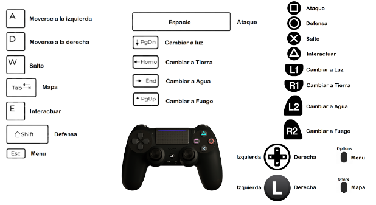
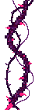

# **Ott: an Elemental Journey - Game Design Document**
- [**Ott: an Elemental Journey - Game Design Document**](#ott-an-elemental-journey---game-design-document)
  - [**1 - Ficha técnica**](#1---ficha-técnica)
  - [**2 - Descripción**](#2---descripción)
  - [**3 - Jugabilidad**](#3---jugabilidad)
    - [**3.1 - Elementos**](#31---elementos)
    - [**3.2 - Mecánicas de Ott**](#32---mecánicas-de-ott)
    - [**3.3 - Ataque**](#33---ataque)
    - [**3.4 - Defensa**](#34---defensa)
    - [**3.5 - Sistema de vida**](#35---sistema-de-vida)
    - [**3.6 - Mapa**](#36---mapa)
    - [**3.7 - Mecánicas de escenario**](#37---mecánicas-de-escenario)
    - [**3.8 - Cámara**](#38---cámara)
  - [**4 - Diseño de nivel**](#4---diseño-de-nivel)
    - [Bosque](#bosque)
  - [**5 - HUD**](#5---hud)
  - [**6 - Visual**](#6---visual)
  - [**7 - Menús y flujo de juego**](#7---menús-y-flujo-de-juego)
  - [**8 - UML**](#8---uml)
  - [**9 - Contenido**](#9---contenido)
    - [**Personajes y enemigos**](#personajes-y-enemigos)
  - [**10 - Recursos**](#10---recursos-utilizados)
  - [**11 - Referencias**](#11---referencias)

## **1 - Ficha técnica**
- **Título**: *Ott: an Elemental Journey*
- **Género**: Metroidvania
- **Target**: Jugadores no noveles exploradores
- **Rating**: PEGI 7
- **Plataforma**: PC (Windows/Mac)
- **Modos de juego**: 
  - Un jugador: Campaña.
  
## **2 - Descripción**
Ott, el protagonista, tiene por destino salvar al mundo de la oscuridad que lo asola. Viajará por tres regiones diferenciadas por las fuerzas de la naturaleza que ejercen sus dominios sobre ellas: El Reino de la Tierra, del Agua y del Fuego. En estos lugares, Ott se encontrará con habitantes corruptos por la oscuridad que tratarán de evitar que cumpla su sino. Durante sus viajes conseguirá dominar los diferentes elementos para derrocar al mal de su tierra natal. Estos elementos le proporcionarán nuevas habilidades con las que explorar zonas antes cerradas para elle, permitiéndole volver atrás en sus pasos y descubrir pequeños secretos que estas tierras ocultan.

## **3 - Jugabilidad**
### **3.1 - Elementos**

El elemento básico que incluye el personaje es luz, a lo largo del juego podrás conseguir el resto de elementos, cada uno en su reino correspondiente, exceptuando la oscuridad, que es la representación del enemigo y superior en fuerza al resto de elementos (no ante luz) tal y como se muestra en el diagrama.

### **3.2 - Mecánicas de Ott**

<table>
    <tr>
        <th>Input</th>
        <th>Acción</th>
    </tr>
    <tr>
        <td>Flechas laterales (teclado)   Mover joystick izquierdo (mando)</td>
        <td><b>Desplazamiento izquierda o derecha</b>. Velocidad constante.
        También se permite movimiento durante el salto a una velocidad reducida.
        </td>
    </tr>
    <tr>
        <td>Barra espaciadora (teclado)   X (PS)   A (XBOX)</td>
        <td><b>Salto</b>: impulso vertical a velocidad constante. No podrá volver a saltar hasta apoyarse en una superficie sólida. Al estar sumergido en agua Ott saltará ligeramente menos.
        </td>
    </tr>
    <tr>
        <td>Flecha superior (teclado)   Mover joystick verrticalmente (mando)</td>
        <td><b>Ascender</b>: Si Ott está en una enrredadera, ascenderá verticalmente.
        </td>
    </tr>
    <tr>
        <td>Flecha inferior (teclado)   Mover joystick verrticalmente (mando)</td>
        <td><b>Descenso</b>: Si Ott está en una enrredadera, descenderá verticalmente. De no ser el caso, si está en una sala que es muy grande, Ott puede mirar hacia abajo, lo que moverá la cámara en sentido vertical descendente revelando lo que hay debajo del jugador.
        </td>
    </tr>
     <tr>
        <td>Teclas numéricas (1-4)   R1, R2, L1, L2 (PS)   RB, RT, LB, LT (XBOX)</td>
        <td><b>Cambio de elemento</b>. No se podrá cambiar de elemento instantáneamente después de haber cambiado al actual (habrá un pequeño <i>cooldown</i> marcado por una animación). 
        </td>
    </tr>
    <tr>
        <td>Tecla "E" (teclado)   Cuadrado (PS)   X (XBOX)</td>
        <td><b>Ataque elemental</b>:
            <ul>
              <li>Habrá un ligero <i>cooldown</i> entre ataques marcado por una animación. </li>
                <li>No hay límite de ataques.</li>
                <li>Puedes realizar un ataque y moverte a la vez.</li>
                <li> La efectividad del ataque contra los enemigos depende del elemento de Ott.</li>
            </ul>
        </td>
    </tr>
    <tr>
        <td><b>MANTENER</b>  Tecla "E" (teclado)   Cuadrado (PS)   X (XBOX)</td>
        <td><b>Ataque cargado</b>: Ott podrá realizarlo si el indicador de “<i>Ataque Cargado</i>” está completamente lleno (matando enemigos). Podrá seguir moviéndose durante el ataque, y al terminar, perderá todas las cargas</td>
    </tr>
    <tr>
        <td>Tecla "R" (teclado)   Círculo (PS)   B (XBOX)</td>
        <td><b>Defensa</b>: Ott dispone de un escudo para defenderse. Podrá tenerlo activo, y moverse todo el tiempo que quiera. (ver <a href="#34---defensa"><b><i>Defensa</i></b></a>).</td>
    </tr>
    <tr>
        <td>Tecla "F" (teclado)  Triángulo (PS)   Y (XBOX)</td>
        <td><b>Interactuar con objetos</b>: ver <a href="#37---mecánicas-de-escenario"><b><i>Mecánicas de escenario</i></b></a>
        </td>
    </tr>
    <tr>
        <td>Tabulador (teclado)   Botón Share (PS)   Botón Vista (XBOX)</td>
        <td><b>Mapa</b>: se podrá consultar la ubicación actual y salas descubiertas (ver <a href="#36---mapa"><b><i>Mapa</i></b></a> más adelante).
        </td>
    </tr>
</table>

### **3.3 - Ataque**
<table>
    <tr>
        <th>Elemento</th>
        <th>Ataque normal</th>
        <th>Ataque cargado</th>
        <th>Habilidad</th>
    </tr>
    <tr>
        <td>Luz</td>
        <td>Ataque básico   </td>
        <td>Igual que el básico pero con doble de daño y un mayor rango</td>
        <td><b>Teletransporte</b> entre determinados focos de luz del mundo</td>
    </tr>
        <tr>
        <td>Tierra</td>
        <td><b>Látigo</b> de medio alcance hacia una dirección.      </td>
        <td>Látigo que se tira en ambos lados, creando daño en el área delimitada por su alcance.</td>
        <td><b>Enredadera</b>: puede escalarse y crece verticalmente cuando interactúa con las zonas de hierba.</td>
    </tr>
    <tr>
        <td>Agua</td>
        <td><b>Chorro de agua</b> (de más rango que el básico, pero con menor daño)      El rectángulo representa el ataque. El jugador lanza un ataque que se detiene al golpear a un enemigo.</td>
        <td>La versión cargada permanece activa durante un tiempo, dañando a todos los enemigos que entran en contacto por ticks, Ott puede moverse y el ataque le sigue.</td>
        <td><b>Buceo</b>: sustituye al movimiento básico de Ott al estar bajo el agua. Con el resto de elementos, Ott subirá hacia la superficie al estar sumergido.</td>
    </tr>
    <tr>
        <td>Fuego</td>
        <td><b>Bola de fuego</b>: con un alto rango que se dispara en la dirección que mira el jugador.      </td>
        <td><b>Bolas de fuego</b>: igual que la bola de fuego normal, pero se lanzan tres seguidas.</td>
        <td><b>Quemar</b> objetos como raíces</td>
    </tr>
</table>

### **3.4 - Defensa**
Ott es capaz de usar un escudo que le permitirá mitigar completamente el daño que vaya a recibir. Cuando tiene el escudo en alto su velocidad de movimiento se ve bastante reducida. Este método de defensa tiene 3 formas de actuar según el elemento que haya atacado a Ott respecto al elemento escogido actualmente:

- **Elemento débil**: Si Ott ha bloqueado un ataque de esta forma, no recibirá daño.
- **Elemento neutro**: Se le pondrá una vida **débil**
- **Elemento fuerte**: Ott queda *stunneado* durante pocos segundos por lo que no podrá realizar ningún tipo de acción hasta que termine el efecto.

### **3.5 - Sistema de vida**

Se empezará con 5 puntos de vida que puede perder cuando recibe un ataque de un enemigo, si entra en contacto con algún enemigo o con algún elemento del dañino entorno (pinchos, zarzas, cristales…).   
El sistema de vida también se ve afectada por el sistema de elementos. Según el tipo de daño elemental que reciba Ott, se recibe una cantidad de daño variable:
- **Elemento débil**: Ott recibe "media vida" de daño, de manera que si no recibe ningún daño en un corto margen de tiempo, recuperará esa vida. De lo contrario, si recibe otro daño debil, perderá la vida por completo, pero si recibe daño neutro o fuerte, además de perder las vidas correspondientes, su vida media pasará a la última vida entera que tenga.
- **Elemento neutro**: Perderá una vida.
- **Elemento fuerte**: Ott recibe un impacto crítico por lo que pierde 2 vidas.

  Spritesheet que representan la vida de Ott en la UI: 
 

Si en algún momento el valor de vida llega a 0, Ott morirá y volverá a aparecer en el último **Punto de Teletransporte** que atravesará, haciendo que los enemigos que haya vencido durante su última vida reaparezcan.  
El máximo de puntos de vida puede ser ampliado mediante fragmentos de vida, que podrán obtenerse explorando el mapa de forma exhaustiva y haciendo un buen uso del mapa de Ott (Véase [***MAPA***](#36---mapa) para la representación de este sistema).

Spritesheet que representan los fragmentos de vida en el juego: 
   

Al obtener 2 de estos, la vida máxima de Ott aumenta en 1 permanentemente. 

(Véase [***HUD***](#5---hud) para la representación de todo este sistema).

### **3.6 - Mapa**
A medida que Ott atraviesa las diferentes salas que conforman el mundo, el pequeño las irá dibujando de una forma esquemática en un mapa, los Santuarios que hayan sido descubiertos aparecen marcados en el mapa. Este mapa será accesible en cualquier momento por el jugador.

Ejemplo: Mapa de Agua semi-completo: 
  

El mapa también es capaz de registrar constantemente la posición de Ott durante su recorrido. Véase [***HUD***](#5---hud) para la representación del mapa.

### **3.7 - Mecánicas de escenario**
<table>
    <tr>
        <td><b>Hierba</b>
         
         
        </td>
        <td>Habilitan la creación de <b>enredaderas</b> sobre ellas usando el poder elemental de tierra/planta</td>
    </tr>
    <tr>
        <td><b>Enredaderas</b> 
          
        </td>
        <td>Hojas dispuestas verticalmente; permiten a Ott <b>subir por ellas</b>.</td>
    </tr>
    <tr>
        <td><b>Zarzas</b>  
          
        </td>
        <td><b>Bloquean</b> el camino. Pueden <b>romperse</b> usando el poder elemental del <b>fuego</b></td>
    </tr>
    <tr>
        <td><b>Zonas profundas de agua</b> 
        Representadas mediante un filtro azul por encima del personaje
           
        </td>
        <td>Habrá que pasar por ellas <b>buceando</b> con el poder del agua. Al usarlo, el personaje es capaz de llegar hasta el fondo del agua, pudiendo caminar por él. Su salto y movimiento se verán ligeramente ralentizados. Al cambiar de elemento bajo el agua, el personaje ascenderá lentamente.</td>
    </tr>
    <tr>
        <td><b>Lámparas de teletransporte</b>
           
        </td>
        <td>Siempre son 2 lámparas que están relacionadas: Funcionan de forma similar a las <b>Tuberías</b> de <i>Mario Bros</i>, donde puedes interactuar con cualquiera de los dos extremos y este moverá a tu personaje al otro extremo.</td>
    </tr>
    <tr>
        <td><b>Santuarios</b>
           
        </td>
        <td><b>Referencia</b> rápida: Bancos de <i>Hollow Knight</i>; Hogueras de <i>Dark Souls</i> y similares. 
        Actúan como <b>zonas de descanso</b> y <b>puntos de guardado</b> para el jugador. Serán su punto de <b>reaparición</b> al morir y al volver a cargar una partida. Al interactuar con ellos <b>recuperas</b> completamente tus <b>puntos de vida</b>, haciendo que los <b>enemigos</b> a tu alrededor <b>reaparezcan</b> si habían sido derrotados y guardando la partida.</td>
    </tr>
</table>

### **3.8 - Cámara**
La cámara sigue al jugador, manteniéndolo en el centro en todo momento excepto al llegar al borde de una sala, momento en que los bordes de la sala coincidirían con el borde de la cámara, causando que el jugador deje de estar en el centro. Cuando se pase de una sala a otra la cámara hace un efecto de fundido en negro, antes de pasar a la siguiente  sala.

## **4 - Diseño de nivel**
El diseño gira entorno al plataformeo y al movimiento del personaje por las ‘salas’, que contienen múltiples plataformas de diferentes tipos, aparte de caminos en un primer lugar bloqueados o inaccesibles debido a la falta de habilidades del personaje que controlamos; y también destaca la presencia múltiples en enemigos.  
Todos los reinos cuentan con los siguientes puntos en común:
  - **Tres tipos de enemigos**, que pueden ser de los 4 elementos (tierra, agua, fuego y oscuridad).
  - Un **elemento**.
  - Un **Miniboss**.
  - Dos **fragmentos de vida ocultos** repartidos entre dos salas.
  - Una **reliquia** única.
  - Salas sin peligros donde se cuenta el lore a través de escritos en rocas.
  
De esta forma es posible aumentar la vida máxima en 1 en cada uno de los reinos (para un total de **8 vidas**) siempre y cuando se exploren casi en su totalidad. 

### Bosque
Se trata de la **primera zona del juego**. Trata de introducir las mecánicas de movimiento y tiene **enemigos** muy **sencillos**, que intentan introducir las mecánicas de ataque y defensa de forma liviana.
El juego comienza con el jugador observando la gigantesca puerta del **Boss Final**, a quien se tendrá que enfrentar para rematar su aventura. Esta puerta muestra **4 luces**, todas **apagadas**, excepto 1, que se encenderá en cuanto el jugador pueda tomar control de Ott. Estas luces representan los diferentes elementos, y la que se enciende al comenzar la aventura representa la luz.

### Zona acuática
La segunda zona del juego estará sumergida en su mayor parte. Para poder desplazarse Ott tendrá que cambiar entre el poncho de agua y el resto de elementos para poder descender y ascender a voluntad por el nivel. Este nivel está muy centrado al rededor de esta mecánica de movimiento, presentando así salas a modo de laberinto y algún que otro puzzle.

### Volcán
La última zona del juego, ambientada un desolado y peligroso ambiente volcánico. En este segmento del juego desta una distribución menos lineal de las salas, brindando más libertad al jugador. El parkour juega un rol importante en el nivel, la lava sustituye a los pinchos del principio, y las plataformas son más pequeñas. Además algunas raíces bloquean el paso del jugador que tendrá que buscar una manera de destruirlas para abrirse paso.

## **5 - HUD**
La interfaz ocupará el menor espacio posible en pantalla, ya que la información acerca del estado del jugador se presentará de forma diegética (integrada en el mundo).  
**Vida**: tendrá una representación ‘doble’:
  - Mediante una *barra de vida* que toma valores discretos.
  - Oscureciendo la pantalla ligeramente cuando quede poca vida.

Justo al lado de la barra de vida aparecerá un medidor circular dividido en ocho fragmentos que indicará el número de cargas obtenidas para el **ataque cargado**.

 

 **Figura 1**: *HUD con 2 puntos de vida y elemento de Tierra (las lámparas cambian de color según tu elemento).*

**Figura 2**: *Oscurecimiento cuando Ott tiene 1 punto de vida.*

## **6 - Visual**
La estética del juego será Pixel Art 2D. El juego está ambientado en un mundo fantástico basado en tres elementos. La parte visual tendrá una estética suave, atrayente y colorida, que contraste la temática más bélica/dramática.  
En el reino del agua predominarán los elementos marinos, representados mediante una paleta de azules y verdes azulados. En el reino del fuego, colores intensos rojos que dibujarán las llamas y otros elementos como la lava. En el reino de tierra, veremos colores y elementos propios de la naturaleza (verdes, amarillos, etc..).  
El personaje principal, **Ott**, en su estado inicial/base será un ser de luz con vestimenta amarilla. Irá incorporando nuevos elementos y con estos cambiará su *skin*.  
El **boss final** es un ser de oscuridad, antagonista a Ott, por lo que se conformará por una paleta oscura de negros y violetas.    
Los personajes de cada elemento portarán los colores de su reino, excepto aquellos infectados por la oscuridad, nuestros **enemigos**, que incorporarán partes del cuerpo **afectadas con los colores del antagonista**.

**Las paletas de cada zona serán las siguientes:**

Algunas capturas del resultado final de las zonas:

## **7 - Menús y flujo de juego**
El juego contará con un menú principal donde poder crear una **partida nueva**, **cargar partida**, **acceder a ajustes** o **salir** de la aplicación. 
Al acceder al submenú de ajustes se podrán encontrar mayoritariamente ajustes de sonido, ajustes para pantalla completa y los controles.

Una vez se haya accedido a una partida, el juego podrá **pausarse** pulsando la tecla ESC (teclado) || Botón Options (PS) || Botón Start (XBOX). Esto hará que toda la ejecución del juego, excepto la música, se detenga. En este menú podremos entrar a **ajustes**, **salir al menú**, **salir al escritorio** y, por supuesto, **reanudar el juego**.

## **8 - UML**
  

## **9 - Contenido**

### **Items Recolectables**
Los siguientes ítems se encontrarán repartidos a lo largo de los 3 mapas explorables y serán recolectados de forma instantánea al colisionar con ellos:

<table>
    <tr>
        <td><b>Elemento</b>
          
        </td>
        <td>
            <ul>
                <li> Son el objeto que permitirá a Ott desbloquear las nuevas habilidades. Son 3, únicos y repartidos cada uno en un mapa distinto. </li>
            </ul>
        </td>
    </tr>

</table>

### **Personajes y enemigos**
Cada zona del juego (Bosque, Lago - Fondo del lago, Volcán y Oscuridad) tendrán 3 tipos de enemigos (débil, medio y fuerte) descrito más adelante. De esta forma, el enemigo débil del bosque no será el mismo que el del Volcán, por ejemplo.
<table>
    <tr>
        <td><b>Escarabajo</b>
          
        </td>
        <td>
            <ul>
                <li>Patrón de movimiento "<b>centinela</b>": al ver al jugador le perseguirá hasta poder ejecutar su ataque.</li>
            </ul>
        </td>
    </tr>
    <tr>
        <td><b>Seta lanzaesporas</b>
          
        </td>
        <td>
            <ul>
                <li><b>Estático</b>.</li>
                <li><b>Lanza esporas</b> hacia el jugador cada poco tiempo.</li>
            </ul>
        </td>
    </tr>
    <tr>
        <td><b>Slime de Roca</b>
          
        </td>
        <td>
            <ul>
                <li>Ataca <b>acercándose</b> al <b>jugador</b> y <b>cayendo</b> hacia él. En ese momento se queda vulnerable al no poder moverse. Al morir, se <b>divide en 2</b>.</li>
            </ul>
        </td>
    </tr>
</table>

Los tres tipos de enemigos estarán presentes en todos los reinos, pudiendo ser de todos los elementos disponibles, excepto oscuridad (estos solo aparecerán al tratar de volver hacia el Boss Final, cuya puerta se encuentra bloqueada en la primera sala del juego hasta que se consigue derrotar a los tres minibosses). De manera que para poder enfrentarse a ellos facilmente, se tendrá que hacer un buen uso de la jerarquía de elementos. (véase [***Elementos***](#31---elementos)).

### **Jefes**
Cada zona del juego dispondrá de 1 jefe propio, con sus mecánicas únicas y donde se tendrá que hacer uso de las habilidades aprendidas en ese reino y los anteriores para poder derrotarlo.
<table>
    <tr>
        <td><b>Gusano de tierra</b>
          
        </td>
        <td>
            <ul>
                <li>En la sala del jefe habrá varias enrredaderas que podrá crear el jugador para poder moverse verticalmente y subir a las plataformas presentes.</li>
              <li> El boss empezará ejecutando dos rondas de ataques horizontales a dos alturas distintas. Haciendo uso del movimiento vertical el jugador tendrá que evitar dichos ataques </li>
              <li> Finalmente, el boss aparecerá encima del jugador, y descenderá hacia él para atacar, haciendo daño por contacto </li>
              <li> En una de las plataformas de la sala, aparecerá aleatoriamente unos pinchos, si el jugador se coloca debajo de dicha plataforma, el jefe descenderá más despacio permitiendo alargando la fase de daño </li>
            </ul>
        </td>
    </tr>
    <tr>
        <td><b>Monstruo Marino</b>
          
        </td>
        <td>
            <ul>
                <li>Cuando el jugador llegue a su sala, el mostruo empezará a perseguirle</li>
                <li>Si consigue atrapar a Ott, este morirá al instante, por lo tanto, su única opción es escapar</li>
              <li>Durante su escapada, será necesario usar los distintos efectos para sortear varios obstáculos que intentarán frenar al jugador, el jefe sin embargo destruirá los obstáculos al tocarlos</li>
              <li>Ott vencerá al jefe llegando hasta el final del recorrido</li>
            </ul>
        </td>
    </tr>
    <tr>
        <td><b>Esqueleto</b>
          
        </td>
        <td>
            <ul>
                <li>El jefe aparecerá cuando Ott entre en su arena de combate</li>
              <li>El jefe es inmune a todos los ataques que recibe</li>
              <li>Sus ataques son muy variados, si Ott está a su altura, le perseguirá para golpearle con su maza, sino, le lanzará proyectiles y ocasionalmente, creará un pilar de fuego mortal bajo los pies del jugador.</li>
              <li>Si Ott rompe la raíz que cuelga del tanque de agua sobre el jefe, este quedará vulnerable y aturdido por unos segundos.</li>
            </ul>
        </td>
    </tr>
    <tr>
        <td><b>Urk, jefe oscuro</b>
          
        </td>
        <td>
            <ul>
                <li>Este jefe a utiliza varios ataques de todos los elementos.</li>
                <li>El ataque de oscuridad, crea un agujero negro que atrae a Ott hacia él a menos que lleve el elemento de luz, igualmente, crea puños que se moverán horizontalmente o verticalmente.</li>
              <li>El ataque de fuego, crea paredes que se desplazan horizontalmente, y dañarán a Ott si entra en contacto con ellas. La única manera de evitarlas es con el elemento de Agua, buceando en unos surco que hay a la altura del suelo.</li>
              <li>El ataque de agua crea 2 burbujas que dispararán a Ott. Estas burbujas permanecen activas durante bastante tiempo, y la única forma de destruirlas antes es creando unas enrredaderas que las exploten./li>
              <li>El jefe puede hacer uso de su habilidad de planta, gracias al cual empezará a curarse. Si Ott utiliza sus ataques de fuego para cortar las raíces que le curan, empezará la fase de daño.</li>
              <li>La fase de daño será de tiempo limitado. Durante el tiempo que esté activa, Ott puede dañar al jefe golpeándole en la cara.</li>
            </ul>
        </td>
    </tr>
</table>

## **10 - Recursos utilizados**

### Recursos públicos
  - [StringStar fields](https://trixelized.itch.io/starstring-fields) (itch.io), Trixie
  - [Oak Woods](https://brullov.itch.io/oak-woods) (itch.io), brullov
  - [Pixel effects pack](https://codemanu.itch.io/pixelart-effect-pack) (itch.io), CodeManu
  - [Hooded protagonist](https://penzilla.itch.io/hooded-protagonist) (itch.io, editado), Penzilla
  - [Fantasy swamp forest tileset](https://theflavare.itch.io/forest-nature-fantasy-tileset) (itch.io), The Flavare
  - [Fire column pixel art effect](https://sanctumpixel.itch.io/fire-column-pixel-art-effect) (itch.io), sanctumpixel
  - [Red Shroom](https://caz-creates-games.itch.io/red-shroom) (itch.io, editado), Caz Creates Games
  - [Fire pixel effect](https://xyezawr.itch.io/free) (itch.io), XYEzawr
  - [Soap bubble burst animation](https://in.pinterest.com/pin/398427898278282138/) (pinterest, editado), vectorStock
  - [Gothicvania Volcanic Area](https://ansimuz.itch.io/gothicvania-volcanic-area) (itch.io), ansimuz
  - [Animated pixel art skeleton](https://astrobob.itch.io/animated-pixel-art-skeleton) (itch.io), AstroBob
  - [Pixel art bug hulk](https://lil-cthulhu.itch.io/pixel-art-bug-hulk) (itch.io, editado), Lil Cthulhu
  - [Free pixel art forest](https://edermunizz.itch.io/free-pixel-art-forest) (itch.io), edermunizz
  - [Pixel art caves](https://assetstore.unity.com/packages/2d/environments/pixel-caves-136235#asset_quality) (unity asset store) GAZIELLE
  - [Warning Boss Tierra](https://pixyfantasystudios.itch.io/warning-sign) (itch.io) Warning Sign Animation
  - [Enredaderas](https://itch.io/queue/c/3117256/p2-assets?game_id=1045084) (itch.io) Plants&Nature Sprites
  - [Gusano MiniBoss Tierra](https://www.aigei.com/item/trap_pack_30_f.html)(aigei, inspiración)陷阱包! 30 免费动画陷阱(Trap Pack! 30 Free Animated Traps)
	
### Música
  - [Fantasy RPG music](https://alkakrab.itch.io/free-25-fantasy-rpg-game-tracks-no-copyright-vol-2) (itch.io), alkakrab
  - [Plant Growing](https://freesound.org/people/IENBA/sounds/648958/) (freesound.org), IENBA
  - [Grass Step Left](https://freesound.org/people/spycrah/sounds/535220/) (freesound.org), spycrah
  - [Page_Turn_24.wav](https://freesound.org/people/Koops/sounds/20258/) (freesound.org), Koops
  - [Story Logo](https://freesound.org/people/SergeQuadrado/sounds/460658/) (freesound.org), SergeQuadrado
  - [Another magic wand spell tinkle.flac](https://freesound.org/people/Timbre/sounds/221683/) (freesound.org), Timbre
  - [Fireball Cast 1](https://freesound.org/people/LiamG_SFX/sounds/334234/) (freesound.org), LiamG_SFX
  - [Whip Crack.m4a](https://freesound.org/people/SciFiSounds/sounds/529925/) (freesound.org), SciFiSounds
  - [Rocks Sliding](https://freesound.org/people/yatoimtop/sounds/400858/) (freesound.org), yatoimtop
  - [SFX_SQUELCH_slayer_06.wav](https://freesound.org/people/MrFossy/sounds/589627/) (freesound.org), MrFossy
  - [Slime Stomp - Pulse 2 - RR9](https://freesound.org/people/voxlab/sounds/663155/) (freesound.org), voxlab
  - [Hard Stomp Sound](https://freesound.org/people/philRacoIndie/sounds/512483/) (freesound.org), philRacoIndie
  - [Fantasy UI Sound Effects](https://ateliermagicae.itch.io/fantasy-ui-sound-effects) (itch.io), AtelierMagicae
  - [Monster Screech | Sound Effect](https://www.youtube.com/watch?v=zq_I79z2iI0) (YouTube), iZone
  - [Essentials Series - Free Sound Effect](https://nox-sound.itch.io/essentials-series-sfx-nox-sound) (itch.io), Nox Sound
  - [TRANSITION.wav](https://freesound.org/people/djfroyd/sounds/466085/) (freesound.org), djfroyd
  - [Swoosh.wav](https://freesound.org/people/berglindsi/sounds/402977/) (freesound.org), berglindsi
  - [Fantasy Sound Effects Library](https://opengameart.org/content/fantasy-sound-effects-library) (OpenGameArt), Little Robot Sound Factory
  - [Wind, hit, time morph](https://opengameart.org/content/wind-hit-time-morph) (OpenGameArt), qubodup
  - Shield Broken (mixkit), RedlistFC
  - Shield Block (mixkit), no figura
  - Ataque Debil 
  - Ataque Fuerte 
  - Ataque Inutil, Yap Audio Production
  - Ataque Ott
  - Ataque Tierra
  - Bicho Muerte
  - Bicho Slash
  - Botón
  - Botón atrás
  - Cambio de elemento
  - Ott Golpeado
  - Activación Lámpara
  - Abrir Mapa
  - Coger elemento
  - Botón de Jugar
  - Transformación Reliquia
  - Coger Reliquia
  - Descansar en Santuario
  - Acercarse a Santuario
  - Alejarse de Santuario

### Recursos propios
  - Shuriken de agua (Basado en https://www.nicepng.com/ourpic/u2y3q8t4t4e6y3e6_water-shuriken-water-pixel-art/)
  - Ataque de fuego de Ott
  - SpriteSheet Ott escalando (Basado en SpriteSheet de Ott)
  - Elementos
  - El resto de assets son nuestros, estos son:
  - Santuarios
  - Puerta del boss final
  - Proyectil de la seta
  - Diseño del jefe final
  - Ataques de oscuridad del jefe final.
  - Elementos de la UI: sliders, botones, vida, indicador de ataque cargado
  - Enemigo slime
  - Fragmentos de vida (velas)
  - Orbes elementales
  - Reliquias
  - Lámparas de vida
  - Barras de vida
  - Oscurecedor de pantalla con poca vida
  - Zarzas oscuras
  - Carteles
  - Escudo
  - Gran árbol del mundo de tierra
  - Sonido Ataque de Agua
  - Plataforma con enredadera del earth miniboss

### Créditos
  - Música del boss final --> Riding Dragons - https://www.boris-sandor.com/

## **11 - Referencias**
 - **Historia**: *The Legend of Zelda: Breath of the Wild*, *Hollow Knight*
 - **Género**: *CastleVania*, *Hollow Knight*
