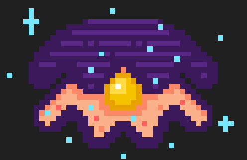

# **Ott: an Elemental Journey - Game Design Document**
- [**Ott: an Elemental Journey - Game Design Document**](#ott-an-elemental-journey---game-design-document)
  - [**1 - Ficha técnica**](#1---ficha-técnica)
  - [**2 - Descripción**](#2---descripción)
  - [**3 - Jugabilidad**](#3---jugabilidad)
    - [**3.1 - Elementos**](#31---elementos)
    - [**3.2 - Mecánicas de Ott**](#32---mecánicas-de-ott)
    - [**3.3 - Ataque**](#33---ataque)
    - [**3.4 - Defensa**](#34---defensa)
    - [**3.5 - Sistema de vida**](#35---sistema-de-vida)
    - [**3.6 - Mapa**](#36---mapa)
    - [**3.7 - Mecánicas de escenario**](#37---mecánicas-de-escenario)
    - [**3.8 - Cámara**](#38---cámara)
  - [**4 - Diseño de nivel**](#4---diseño-de-nivel)
    - [Bosque](#bosque)
  - [**5 - HUD**](#5---hud)
  - [**6 - Visual**](#6---visual)
  - [**7 - Menús y flujo de juego**](#7---menús-y-flujo-de-juego)
  - [**8 - UML**](#8---uml)
  - [**9 - Contenido**](#9---contenido)
    - [**Personajes y enemigos**](#personajes-y-enemigos)
  - [**10 - Recursos**](#10---recursos-utilizados)
  - [**11 - QA**](#11---qa)
    - [**11.1 - Objetivos y preguntas de investigación**](#111---objetivos-y-preguntas-de-investigación)
    - [**11.2 - Duración y entorno de realización**](#112---duración-y-entorno-de-realización)
    - [**11.3 - Descripción de las tareas del probador**](#113---descripción-de-las-tareas-del-probador)
    - [**11.4 - Instrucciones iniciales**](#114---instrucciones-iniciales)
    - [**11.5 - Comportamiento del investigador**](#115---comportamiento-del-investigador)
    - [**11.6 - Diseño de la evaluación**](#116---diseño-de-la-evaluación)
    - [**11.7 - Observaciones**](#117---observaciones)
    - [**11.8 - Conclusiones y cambios**](#118---conclusiones-y-cambios)
  - [**12 - Web y redes asociadas**](#12---web-y-redes-asociadas)
  - [**13 - Referencias**](#13---referencias)

## **1 - Ficha técnica**
- **Título**: *Ott: an Elemental Journey*
- **Género**: Metroidvania
- **Target**: Jugadores no noveles exploradores
- **Rating**: PEGI 7
- **Plataforma**: PC (Windows)
- **Modos de juego**: 
  - Un jugador: Campaña.
  
## **2 - Descripción**
Ott, el protagonista, tiene por destino salvar al mundo de la oscuridad que lo asola. Viajará por tres regiones diferenciadas por las fuerzas de la naturaleza que ejercen sus dominios sobre ellas: El Reino de la Tierra, del Agua y del Fuego. En estos lugares, Ott se encontrará con habitantes corruptos por la oscuridad que tratarán de evitar que cumpla su sino. Durante sus viajes conseguirá dominar los diferentes elementos para derrocar al mal de su tierra natal. Estos elementos le proporcionarán nuevas habilidades con las que explorar zonas antes cerradas para elle, permitiéndole volver atrás en sus pasos y descubrir pequeños secretos que estas tierras ocultan.

## **3 - Jugabilidad**
### **3.1 - Elementos**

El elemento básico que incluye el personaje es luz, a lo largo del juego podrás conseguir el resto de elementos, cada uno en su reino correspondiente, exceptuando la oscuridad, que es la representación del enemigo y superior en fuerza al resto de elementos (no ante luz) tal y como se muestra en el diagrama.

### **3.2 - Mecánicas de Ott**

<table>
    <tr>
        <th>Input</th>
        <th>Acción</th>
    </tr>
    <tr>
        <td>Flechas laterales (teclado)   Mover joystick izquierdo (mando)</td>
        <td><b>Desplazamiento izquierda o derecha</b>. Velocidad constante.
        También se permite movimiento durante el salto a una velocidad ligeramente aumentada.
        </td>
    </tr>
    <tr>
        <td>Barra espaciadora (teclado)   X (PS)   A (XBOX)</td>
        <td><b>Salto</b>: impulso vertical a velocidad constante. No podrá volver a saltar hasta apoyarse en una superficie sólida. Al estar sumergido en agua Ott saltará ligeramente menos.
        </td>
    </tr>
    <tr>
        <td>Flecha superior (teclado)   Mover joystick verrticalmente (mando)</td>
        <td><b>Ascender</b>: Si Ott está en una enrredadera, ascenderá verticalmente.
        </td>
    </tr>
    <tr>
        <td>Flecha inferior (teclado)   Mover joystick verrticalmente (mando)</td>
        <td><b>Descenso</b>: Si Ott está en una enrredadera, descenderá verticalmente. De no ser el caso, si está en una sala que es muy grande, Ott puede mirar hacia abajo, lo que moverá la cámara en sentido vertical descendente revelando lo que hay debajo del jugador.
        </td>
    </tr>
     <tr>
        <td>Teclas numéricas (1-4)   R1, R2, L1, L2 (PS)   RB, RT, LB, LT (XBOX)</td>
        <td><b>Cambio de elemento</b>. No se podrá cambiar de elemento instantáneamente después de haber cambiado al actual (habrá un pequeño <i>cooldown</i> marcado por una animación). 
        </td>
    </tr>
    <tr>
        <td>Tecla "E" (teclado)   Cuadrado (PS)   X (XBOX)</td>
        <td><b>Ataque elemental</b>:
            <ul>
              <li>Habrá un ligero <i>cooldown</i> entre ataques marcado por una animación. </li>
                <li>No hay límite de ataques.</li>
                <li>Puedes realizar un ataque y moverte a la vez.</li>
                <li> La efectividad del ataque contra los enemigos depende del elemento de Ott.</li>
            </ul>
        </td>
    </tr>
    <tr>
        <td><b>MANTENER</b>  Tecla "E" (teclado)   Cuadrado (PS)   X (XBOX)</td>
        <td><b>Ataque cargado</b>: Ott podrá realizarlo si el indicador de “<i>Ataque Cargado</i>” está completamente lleno (matando enemigos). Podrá seguir moviéndose durante el ataque, y al terminar, perderá todas las cargas</td>
    </tr>
    <tr>
        <td>Tecla "R" (teclado)   Círculo (PS)   B (XBOX)</td>
        <td><b>Defensa</b>: Ott dispone de un escudo para defenderse. Podrá tenerlo activo, y moverse todo el tiempo que quiera. (ver <a href="#34---defensa"><b><i>Defensa</i></b></a>).</td>
    </tr>
    <tr>
        <td>Tecla "F" (teclado)  Triángulo (PS)   Y (XBOX)</td>
        <td><b>Interactuar con objetos</b>: ver <a href="#37---mecánicas-de-escenario"><b><i>Mecánicas de escenario</i></b></a>
        </td>
    </tr>
    <tr>
        <td>Tabulador (teclado)   Botón Share (PS)   Botón Vista (XBOX)</td>
        <td><b>Mapa</b>: se podrá consultar la ubicación actual y salas descubiertas (ver <a href="#36---mapa"><b><i>Mapa</i></b></a> más adelante).
        </td>
    </tr>
</table>

### **3.3 - Ataque**

Ott tiene dos formas de atacar: **Simple** y **Cargada**. Su *ataque simple* no tiene limitación de uso, mientras que el *cargado* requiere de rellenar un pequeño indicador (situado al lado de las vidas en el HUD) matando enemigos. Con esto, se trata de incentivar al jugador a matar a los enemigos y no a huir de ellos. Cada enemigo da una cantidad X de cargas del indicar de ataque cargado (máximo de 8).

<table>
    <tr>
        <th>Elemento</th>
        <th>Ataque normal</th>
        <th>Ataque cargado</th>
        <th>Habilidad</th>
    </tr>
    <tr>
        <td>Luz</td>
        <td>Ataque básico   </td>
        <td>Igual que el básico pero con doble de daño y un mayor rango</td>
        <td><b>Teletransporte</b> entre determinados focos de luz del mundo</td>
    </tr>
        <tr>
        <td>Tierra</td>
        <td><b>Látigo</b> de medio alcance hacia una dirección.      </td>
        <td>Látigo que se tira en ambos lados, creando daño en el área delimitada por su alcance.</td>
        <td><b>Enredadera</b>: puede escalarse y crece verticalmente cuando interactúa con las zonas de hierba.</td>
    </tr>
    <tr>
        <td>Agua</td>
        <td><b>Chorro de agua</b> (de más rango que el básico)      El jugador lanza un ataque que se detiene al golpear a un enemigo.</td>
        <td>La versión cargada permanece activa durante un tiempo, dañando a todos los enemigos que entran en contacto por ticks, Ott puede moverse y el ataque le sigue.</td>
        <td><b>Buceo</b>: sustituye al movimiento básico de Ott al estar bajo el agua. Con el resto de elementos, Ott subirá hacia la superficie al estar sumergido.</td>
    </tr>
    <tr>
        <td>Fuego</td>
        <td><b>Bola de fuego</b>: con un alto rango que se dispara en la dirección que mira el jugador.      </td>
        <td><b>Bolas de fuego</b>: igual que la bola de fuego normal, pero se lanzan tres seguidas.</td>
        <td><b>Quemar</b> objetos como raíces</td>
    </tr>
</table>

### **3.4 - Defensa**
Ott es capaz de usar un escudo que le permitirá mitigar el daño que vaya a recibir. Cuando tiene el escudo en alto su velocidad de movimiento se ve bastante reducida. Este método de defensa tiene 3 formas de actuar según el elemento que haya atacado a Ott respecto al elemento escogido actualmente:

- **Elemento débil**: Ott no recibirá daño.
- **Elemento neutro**: Se le pondrá una vida **débil**
- **Elemento fuerte**: Ott queda *stunneado* durante pocos segundos por lo que no podrá realizar ningún tipo de acción hasta que termine el efecto.

### **3.5 - Sistema de vida**

Se empezará con 5 puntos de vida que puede perder cuando recibe un ataque de un enemigo, si entra en contacto con algún enemigo o con algún elemento dañino del entorno (pinchos, zarzas, cristales…).   
El sistema de vida también se ve afectada por el sistema de elementos. Según el tipo de daño elemental que reciba Ott, se recibe una cantidad de daño variable:
- **Elemento débil**: Ott recibe "media vida" de daño, de manera que si no recibe ningún daño en un corto margen de tiempo, recuperará esa vida. De lo contrario, si recibe otro daño debil, perderá la vida por completo, pero si recibe daño neutro o fuerte, además de perder las vidas correspondientes, su vida media pasará a la última vida entera que tenga.
- **Elemento neutro**: Perderá una vida.
- **Elemento fuerte**: Ott recibe un impacto crítico por lo que pierde 2 vidas.

Spritesheet que representan la vida de Ott en la UI: 
   
LLENA / VACÍA / DÉBIL

Si en algún momento el valor de vida llega a 0, Ott morirá y volverá a aparecer en el último **Zona de Guardado** en la que Ott haya guardado el juego (habiendo cogido un *elemento* o descansando en un *Santuario*), haciendo que los enemigos que haya vencido durante su última vida reaparezcan.  
El máximo de puntos de vida puede ser ampliado mediante fragmentos de vida, que podrán obtenerse explorando los diferentes reinos de forma exhaustiva y haciendo un buen uso del mapa de Ott (Véase [***MAPA***](#36---mapa) para la representación de este sistema).

Spritesheet que representan los fragmentos de vida en el juego: 
   

Al obtener 2 de estos, la vida máxima de Ott aumenta en 1 permanentemente. 

(Véase [***HUD***](#5---hud) para la representación de todo este sistema).

### **3.6 - Mapa**
A medida que Ott atraviesa las diferentes salas que conforman el mundo, el pequeño las irá dibujando de una forma esquemática en un mapa, los Santuarios que hayan sido descubiertos aparecen marcados en el mapa. Este mapa será accesible en cualquier momento por el jugador.

Ejemplo: Mapa de Agua semi-completo: 
  

El mapa también es capaz de registrar constantemente la posición de Ott durante su recorrido. Véase [***HUD***](#5---hud) para la representación del mapa.

### **3.7 - Mecánicas de escenario**
<table>
    <tr>
        <td><b>Hierba</b>
         
         
        </td>
        <td>Habilitan la creación de <b>enredaderas</b> sobre ellas usando el poder elemental de tierra/planta</td>
    </tr>
    <tr>
        <td><b>Enredaderas</b> 
          
        </td>
        <td>Hojas dispuestas verticalmente; permiten a Ott <b>subir por ellas</b>.</td>
    </tr>
    <tr>
        <td><b>Zarzas</b>  
          
        </td>
        <td><b>Bloquean</b> el camino. Pueden <b>romperse</b> usando el poder elemental del <b>fuego</b></td>
    </tr>
    <tr>
        <td><b>Zonas profundas de agua</b> 
        Representadas mediante un filtro azul por encima del personaje
           
        </td>
        <td>Habrá que pasar por ellas <b>buceando</b> con el poder del agua. Al usarlo, el personaje es capaz de llegar hasta el fondo del agua, pudiendo caminar por él. Su salto y movimiento se verán ligeramente ralentizados. Al cambiar de elemento bajo el agua, el personaje ascenderá lentamente.</td>
    </tr>
    <tr>
        <td><b>Lámparas de teletransporte</b>
           
        </td>
        <td>Siempre son 2 lámparas que están relacionadas: Funcionan de forma similar a las <b>Tuberías</b> de <i>Mario Bros</i>, donde puedes interactuar con cualquiera de los dos extremos y este moverá a tu personaje al otro extremo.</td>
    </tr>
    <tr>
        <td><b>Santuarios</b>
           
        </td>
        <td><b>Referencia</b> rápida: Bancos de <i>Hollow Knight</i>; Hogueras de <i>Dark Souls</i> y similares. 
        Actúan como <b>zonas de descanso</b> y <b>puntos de guardado</b> para el jugador. Serán su punto de <b>reaparición</b> al morir y al volver a cargar una partida. Al interactuar con ellos <b>recuperas</b> completamente tus <b>puntos de vida</b>, haciendo que los <b>enemigos</b> a tu alrededor <b>reaparezcan</b> si habían sido derrotados y guardando la partida.</td>
    </tr>
</table>

### **3.8 - Cámara**
La cámara sigue al jugador, manteniéndolo en el centro en todo momento excepto al llegar al borde de una sala, momento en que los bordes de la sala coincidirían con el borde de la cámara, causando que el jugador deje de estar en el centro. Cuando se pase de una sala a otra la cámara hace un efecto de fundido en negro, antes de pasar a la siguiente  sala.

## **4 - Diseño de nivel**
El diseño gira entorno al plataformeo y al movimiento del personaje por las ‘salas’, que contienen múltiples plataformas de diferentes tipos, aparte de caminos en un primer lugar bloqueados o inaccesibles debido a la falta de habilidades del personaje que controlamos; y también destaca la presencia múltiples en enemigos.  
Todos los reinos cuentan con los siguientes puntos en común:
  - **Tres tipos de enemigos**, que pueden ser de los 4 elementos (tierra, agua, fuego y oscuridad).
  - Un **elemento**.
  - Un **Miniboss**.
  - Dos **fragmentos de vida ocultos** repartidos entre dos salas.
  - Una **reliquia** única.
  - Salas sin peligros donde se cuenta el lore a través de escritos en rocas.
  
De esta forma es posible aumentar la vida máxima en 1 en cada uno de los reinos (para un total de **8 vidas**) siempre y cuando se exploren casi en su totalidad. 

### Bosque
Se trata de la **primera zona del juego**. Trata de introducir las mecánicas de movimiento y tiene poca cantidad de enemigos.
El juego comienza con el jugador observando la puerta del **Boss Final**, a quien se tendrá que enfrentar para rematar su aventura. Esta puerta muestra **4 luces**, todas **apagadas**, excepto 1, estará encendida desde el primero momento. Estas luces representan los diferentes elementos, y la que se enciende al comenzar la aventura representa la luz.

   

#### Dinámica

En este mundo, pretendemos que el jugador aprenda a usar las mecánicas básicas, como movimiento, ataque, teleportación y guardado, por lo que el mapa es lo más intuitivo posible, pero manteniendo un número elevado de salas. 

La parte de abajo del mapa es circular, por lo que no importa el lado por el que el jugador elija bajar, llegará a la sala del elemento, donde, al igual que en el resto del mapa, verá un cartel explicativo de cómo usar su nuevo poder: **las enredaderas**.

A lo largo del mapa el jugador encontrará enemigos de no mucha complejidad, como setas y cucarachas de agua o de tierra, es decir, o neutrales o débiles respecto a los elementos que pudiera tener en ese punto, para que se familiarice con el combate de forma mas segura.

El boss también tiene una complejidad media/baja, con bastantes indicadores de por donde van a venir los ataques, y cual es la mejor estrategia para derrotarlo (por medio de un cartel). (Véase [***HUD***](#jefes) para una explicación más profunda).

Para tratar de inculcar la reexploración del mapa como algo importante, se le muestra al jugador en su primera sala una enredadera en el centro de una plataforma por la que obligatoriamente Ott tendrá que pasar. Este objeto interactivo lleva a la *primera reliquia del juego*. 

Se ha colocado el cartel del mapa en una zona que sea imposible saltarse: en la sala principal de este nivel. Este cartel incita al jugador a abrir el mapa y descubrir que Ott ha sido capaz de pintar todo lo recorrido hasta ahora. 
Al ver este mapa, planteamos que el jugador sea consciente de que esta Sala 1 tiene una abertura en la parte superior a la que el jugador todavía no podrá llegar, al igual que una por la parte derecha. De esta forma el jugador tratará de prestar atención a lo que aparece en el mapa porque revela información muy útil.

En resumen, es un mapa bastante asumible para todos los jugadores y no pretende perderlos ni frustrarlos, sino guiarlos en su primer encuentro con el juego, e ir implantando ideas como el beneficio de volver atrás para reexplorar zonas con nuevas habilidades o la importancia de guardar o manejar los elementos. 

### Zona acuática
La segunda zona del juego estará sumergida en su mayor parte. Para poder desplazarse Ott tendrá que cambiar entre el elemento de agua y el resto para poder descender y ascender a voluntad por el nivel. Este nivel está muy centrado alrededor de esta mecánica de movimiento, presentando así salas a modo de laberinto.

   

#### Dinámica

Al contrario que en el anterior mapa, aquí ya damos por hecho que el jugador ha absorbido las lecciones inculcadas, por lo que la dificultad aumenta de forma considerable, con muchos menos **Santuarios** y muchos más enemigos.

Al principio, el 90% del mapa queda bloqueado al jugador hasta que consiga el elemento de agua, ya que el resto de elementos no pueden sumergirse en esta, lo que hace que esta primera parte sea completamente lineal. Una vez conseguido el elemento sin embargo, la cosa cambia. 
Para obligar al jugador a aprender la nueva mecánica de movimiento añadida con este elemento, se ha diseñado esta primera zona lineal, en la que, una vez se coge el elemento de la zona, su única salida sea por la piscina de agua que se sitúa en la parte inferior de la sala 3, donde podrá aprender que puede llegar al fondo del agua con este elemento. La habitación contigua es un laberinto que fuerza al jugador a cambiar de elemento para entender la mecánica a la perfección.

La principal dinámica de este mapa es lo laberíntico que es: es el mapa más grande en cuanto a superficie y tiene el mayor número de salas, lo que hace que sea muy fácil para el jugador perderse y desorientarse. En caso de que el jugador no haya encontrado utilidad al minimapa, este se convertirá en una de sus más valiosas herramientas a la hora de superar este mundo.

Además, una vez que el jugador consiga el elemento de agua y pueda sumergirse en las profundidades, se verá obligado a cambiar de elemento constantemente para poder desplazarse por las diferentes salas, por lo que de nuevo se pretende acostumbrar al jugador a no estancarse en uno de ellos. 

El boss de este mapa, también aumenta en dificultad respecto al anterior. Se trata de una tensa persecución, difícilmente superable en un primer intento, que pretende frustrar, ya que el más mínimo fallo y mala reacción puede suponer la muerte de Ott, haciendo que el jugador tenga que repetir toda la batalla hasta perfeccionar mecánica de cambio de elemento en el agua.

### Volcán

Es la zona final y más difícil del juego. Presenta gran cantidad de enemigos y una estética saturada y hostil. Se ha querido hacer un nivel ligeramtente lioso donde el minimapa puede no ser una ayuda tan grande, pues las salas están repartidas y no comparten conexiones. La memoria del jugador jugará un papel fundamental en este nivel.

   

#### Dinámica

Por último, el mapa de fuego sigue la tendencia de cambiar por completo la experiencia de navegación en cada mapa, esta vez basando sobre todo la exploración en el teletransporte con lámparas.

En este mapa se da casi total libertad al jugador de ir hacia donde quiera y no se le fuerza a coger el elemento antes de poder explorar. No obstante, algunas partes importantes del mapa, como el acceso al Miniboss de la zona, se mantienen bloqueadas por zarzas que impiden el paso y dañarán al jugador en caso de que intente atravesarlas. Estos objetos solo pueden ser eliminados con el ataque del elemento de fuego.

Inspirados por las **mansiones de Boo de Mario Bros**, que incluyen una gran cantidad de puertas para confundir al jugador y que pueden guiarle tanto a recompensas como a salas repletas de enemigos, cada una de las lámparas de este mapa tiene un destino sorpresa para el jugador, lo que hace que la exploración se sienta mucho más arriesgada.

El boss de este mapa requiere algo de astucia, ya que para poder derrotarlo, el jugador deberá darse cuenta de que es completamente inmune a cualquier ataque, y posteriormente ponerse creativo buscando formas de derrotarlo. 
Si es perspicaz, se dará cuenta de que hay un depósito de agua por encima del boss, del que cuelga una zarza, y solo después de eliminarla, el agua caerá sobre el jefe y empezará la batalla de verdad, ya que el jefe podrá recibir vida a partir de entonces.

Es una pelea muy dura, que puede que desesperar a muchos, pero no deja de ser el último miniboss del juego, y el jugador ya cuenta con todos los elementos disponibles para derrotarlo.

## **5 - HUD**
La interfaz ocupará el menor espacio posible en pantalla, ya que la información acerca del estado del jugador se presentará de forma diegética (integrada en el mundo).  
**Vida**: tendrá una representación ‘doble’:
  - Mediante una *barra de vida* que toma valores discretos.
  - Oscureciendo la pantalla ligeramente cuando quede poca vida.

Justo al lado de la barra de vida aparecerá un medidor circular dividido en ocho fragmentos que indicará el número de cargas obtenidas para el **ataque cargado** (mencionado en la sección [***3.3 - Ataque***](#33---ataque)). 

*HUD con 2 puntos de vida y elemento de Tierra (las lámparas cambian de color según tu elemento).*

*Oscurecimiento cuando Ott tiene 1 punto de vida.*

## **6 - Visual**
La estética del juego será Pixel Art 2D. El juego está ambientado en un mundo fantástico basado en tres elementos. La parte visual tendrá una estética suave, atrayente y colorida, que contraste la temática más bélica/dramática.  
En el reino del agua predominarán los elementos marinos, representados mediante una paleta de azules y verdes azulados. En el reino del fuego, colores intensos rojos que dibujarán las llamas y otros elementos como la lava. En el reino de tierra, veremos colores y elementos propios de la naturaleza (verdes, amarillos, etc..).  
El personaje principal, **Ott**, en su estado inicial/base será un ser de luz con vestimenta amarilla. Irá incorporando nuevos elementos y con estos cambiará su *skin*.  
El **boss final** es un ser de oscuridad, antagonista a Ott, por lo que se conformará por una paleta oscura de negros y violetas.    
Los personajes de cada elemento portarán los colores de su reino, excepto aquellos infectados por la oscuridad, nuestros **enemigos**, que incorporarán partes del cuerpo **afectadas con los colores del antagonista**.

**Las paletas de cada zona serán las siguientes:**

Algunas capturas del resultado final de las zonas:

## **7 - Menús y flujo de juego**
El juego contará con un menú principal donde poder crear una **partida nueva**, **cargar partida**, **acceder a ajustes** o **salir** de la aplicación. 
Al acceder al submenú de ajustes se podrán encontrar mayoritariamente ajustes de sonido, ajustes para pantalla completa y los controles.

Una vez se haya accedido a una partida, el juego podrá **pausarse** pulsando la tecla ESC (teclado) || Botón Options (PS) || Botón Start (XBOX). Esto hará que toda la ejecución del juego, excepto la música, se detenga. En este menú podremos entrar a **ajustes**, **salir al menú**, **salir al escritorio** y, por supuesto, **reanudar el juego**.

## **8 - UML**
  

## **9 - Contenido**

### **Items Recolectables**
Los siguientes ítems se encontrarán repartidos a lo largo de los 3 mapas explorables y serán recolectados de forma instantánea al colisionar con ellos:

<table>
    <tr>
        <td><b>Elemento</b>
          
        </td>
        <td>
            <ul>
                <li> Son el objeto que permitirá a Ott desbloquear las nuevas habilidades. Son 3, únicos y repartidos cada uno en un mapa distinto. </li>
                <li> Una vez se coja uno de ellos, el <i>spawn-point</i> de Ott se setteará a la posición del elemento.</li>
            </ul>
        </td>
    </tr>
        <tr>
        <td><b>Fragmento de Vida</b>
          
        </td>
        <td>
            <ul>
                <li> Dan al jugador la oportunidad de aumentar su vida máxima en 1 cuando coge dos de estos fragmentos. </li>
                <li> Hay un total de 6: 2 en cada mapa explorable.</li>
                <li> Se encuentran ocultos a lo largo de los mismos.</li>
                <li> Al ser recogidos un texto en el centro de la pantalla muestra cuánto se tienen: 1/2 o 2/2</li>
            </ul>
        </td>
    </tr>
        <tr>
        <td><b>Reliquia</b>
          
          
          
        </td>
        <td>
            <ul>
                <li> Al igual que los elementos, hay 1 por mapa. </li>
                <li> Al recoger las 3 reliquias se desbloquea una corona, un <b>blush</b> en las mejillas y zapatitos. No tienen efecto mecánico, solo estético. </li>
                <li> Están ciertamente escondidas o detrás de algún reto en cada uno de los mapas. </li>
            </ul>
        </td>
    </tr>

</table>

### **Personajes y enemigos**
Cada zona del juego (Bosque, Lago - Fondo del lago, Volcán y Oscuridad) tendrán 3 tipos de enemigos (débil, medio y fuerte) descrito más adelante. De esta forma, el enemigo débil del bosque no será el mismo que el del Volcán, por ejemplo.
<table>
    <tr>
        <td><b>Escarabajo</b>
          
        </td>
        <td>
            <ul>
                <li>Patrón de movimiento "<b>centinela</b>": al ver al jugador le perseguirá hasta poder ejecutar su ataque.</li>
            </ul>
        </td>
    </tr>
    <tr>
        <td><b>Seta lanzaesporas</b>
          
        </td>
        <td>
            <ul>
                <li><b>Estático</b>.</li>
                <li><b>Lanza esporas</b> hacia el jugador cada poco tiempo.</li>
            </ul>
        </td>
    </tr>
    <tr>
        <td><b>Slime de Roca</b>
          
        </td>
        <td>
            <ul>
                <li>Ataca <b>acercándose</b> al <b>jugador</b> y <b>cayendo</b> hacia él. En ese momento se queda vulnerable al no poder moverse. Al morir, se <b>divide en 2</b>.</li>
            </ul>
        </td>
    </tr>
</table>

Los tres tipos de enemigos estarán presentes en todos los reinos, pudiendo ser de todos los elementos disponibles, excepto oscuridad (estos solo aparecerán al tratar de volver hacia el Boss Final, cuya puerta se encuentra bloqueada en la primera sala del juego hasta que se consigue derrotar a los tres minibosses). De manera que para poder enfrentarse a ellos facilmente, se tendrá que hacer un buen uso de la jerarquía de elementos. (véase [***Elementos***](#31---elementos)).

### **Jefes**
Cada zona del juego dispondrá de 1 jefe propio, con sus mecánicas únicas y donde se tendrá que hacer uso de las habilidades aprendidas en ese reino y los anteriores para poder derrotarlo.
<table>
    <tr>
        <td><b>Gusano de tierra</b>
          
        </td>
        <td>
            <ul>
                <li>En la sala del jefe habrá varias enrredaderas que podrá crear el jugador para poder moverse verticalmente y subir a las plataformas presentes.</li>
              <li> El boss empezará ejecutando dos rondas de ataques horizontales a dos alturas distintas. Haciendo uso del movimiento vertical el jugador tendrá que evitar dichos ataques </li>
              <li> Finalmente, el boss aparecerá encima del jugador, y descenderá hacia él para atacar, haciendo daño por contacto </li>
              <li> En una de las plataformas de la sala, aparecerá aleatoriamente unos pinchos, si el jugador se coloca debajo de dicha plataforma, el jefe descenderá más despacio permitiendo alargando la fase de daño </li>
            </ul>
        </td>
    </tr>
    <tr>
        <td><b>Monstruo Marino</b>
          
        </td>
        <td>
            <ul>
                <li>Cuando el jugador llegue a su sala, el mostruo empezará a perseguirle</li>
                <li>Si consigue atrapar a Ott, este morirá al instante, por lo tanto, su única opción es escapar</li>
              <li>Durante su escapada, será necesario usar los distintos efectos para sortear varios obstáculos que intentarán frenar al jugador, el jefe sin embargo destruirá los obstáculos al tocarlos</li>
              <li>Ott vencerá al jefe llegando hasta el final del recorrido</li>
            </ul>
        </td>
    </tr>
    <tr>
        <td><b>Esqueleto</b>
          
        </td>
        <td>
            <ul>
                <li>El jefe aparecerá cuando Ott entre en su arena de combate</li>
              <li>El jefe es inmune a todos los ataques que recibe</li>
              <li>Sus ataques son muy variados, si Ott está a su altura, le perseguirá para golpearle con su maza, sino, le lanzará proyectiles y ocasionalmente, creará un pilar de fuego mortal bajo los pies del jugador.</li>
              <li>Si Ott rompe la raíz que cuelga del tanque de agua sobre el jefe, este quedará vulnerable y aturdido por unos segundos.</li>
            </ul>
        </td>
    </tr>
    <tr>
        <td><b>Urk, jefe oscuro</b>
          
        </td>
        <td>
            <ul>
                <li>Este jefe a utiliza varios ataques de todos los elementos.</li>
                <li>El ataque de oscuridad, crea un agujero negro que atrae a Ott hacia él a menos que lleve el elemento de luz, igualmente, crea puños que se moverán horizontalmente o verticalmente.</li>
              <li><b>El ataque de fuego</b>, crea paredes que se desplazan horizontalmente, y dañarán a Ott si entra en contacto con ellas. La única manera de evitarlas es con el elemento de Agua, buceando en unos surco que hay a la altura del suelo.</li>
              <li><b>El ataque de agua</b> crea 2 burbujas que dispararán a Ott. Estas burbujas permanecen activas durante bastante tiempo, y la única forma de destruirlas antes es creando unas enrredaderas que las exploten./li>
              <li>El jefe puede hacer uso de su <b>habilidad de planta</b>, gracias al cual empezará a curarse. Si Ott utiliza sus ataques de fuego para cortar las raíces que le curan, empezará la fase de daño.</li>
              <li><b>La fase de daño</b> será de tiempo limitado. Durante el tiempo que esté activa, Ott puede dañar al jefe golpeándole en la cara.</li>
            </ul>
        </td>
    </tr>
</table>

## **10 - Recursos utilizados**

### Recursos públicos

Por desgracia, no hemos conseguido encontrar algunas de las referencias de los sonidos utilizados a continuación, pero sí podemos afirmar que son todos sacados de páginas web con licencias de uso libre y ninguno de pago.

  - [StringStar fields](https://trixelized.itch.io/starstring-fields) (itch.io), Trixie
  - [Oak Woods](https://brullov.itch.io/oak-woods) (itch.io), brullov
  - [Pixel effects pack](https://codemanu.itch.io/pixelart-effect-pack) (itch.io), CodeManu
  - [Hooded protagonist](https://penzilla.itch.io/hooded-protagonist) (itch.io, editado), Penzilla
  - [Fantasy swamp forest tileset](https://theflavare.itch.io/forest-nature-fantasy-tileset) (itch.io), The Flavare
  - [Fire column pixel art effect](https://sanctumpixel.itch.io/fire-column-pixel-art-effect) (itch.io), sanctumpixel
  - [Red Shroom](https://caz-creates-games.itch.io/red-shroom) (itch.io, editado), Caz Creates Games
  - [Fire pixel effect](https://xyezawr.itch.io/free) (itch.io), XYEzawr
  - [Soap bubble burst animation](https://in.pinterest.com/pin/398427898278282138/) (pinterest, editado), vectorStock
  - [Gothicvania Volcanic Area](https://ansimuz.itch.io/gothicvania-volcanic-area) (itch.io), ansimuz
  - [Animated pixel art skeleton](https://astrobob.itch.io/animated-pixel-art-skeleton) (itch.io), AstroBob
  - [Pixel art bug hulk](https://lil-cthulhu.itch.io/pixel-art-bug-hulk) (itch.io, editado), Lil Cthulhu
  - [Free pixel art forest](https://edermunizz.itch.io/free-pixel-art-forest) (itch.io), edermunizz
  - [Pixel art caves](https://assetstore.unity.com/packages/2d/environments/pixel-caves-136235#asset_quality) (unity asset store) GAZIELLE
  - [Warning Boss Tierra](https://pixyfantasystudios.itch.io/warning-sign) (itch.io) Warning Sign Animation
  - [Enredaderas](https://itch.io/queue/c/3117256/p2-assets?game_id=1045084) (itch.io) Plants&Nature Sprites
  - [Gusano MiniBoss Tierra](https://www.aigei.com/item/trap_pack_30_f.html)(aigei, inspiración)陷阱包! 30 免费动画陷阱(Trap Pack! 30 Free Animated Traps)
	
### Música
  - [Fantasy RPG music](https://alkakrab.itch.io/free-25-fantasy-rpg-game-tracks-no-copyright-vol-2) (itch.io), alkakrab
  - [Plant Growing](https://freesound.org/people/IENBA/sounds/648958/) (freesound.org), IENBA
  - [Grass Step Left](https://freesound.org/people/spycrah/sounds/535220/) (freesound.org), spycrah
  - [Page_Turn_24.wav](https://freesound.org/people/Koops/sounds/20258/) (freesound.org), Koops
  - [Story Logo](https://freesound.org/people/SergeQuadrado/sounds/460658/) (freesound.org), SergeQuadrado
  - [Another magic wand spell tinkle.flac](https://freesound.org/people/Timbre/sounds/221683/) (freesound.org), Timbre
  - [Fireball Cast 1](https://freesound.org/people/LiamG_SFX/sounds/334234/) (freesound.org), LiamG_SFX
  - [Whip Crack.m4a](https://freesound.org/people/SciFiSounds/sounds/529925/) (freesound.org), SciFiSounds
  - [Rocks Sliding](https://freesound.org/people/yatoimtop/sounds/400858/) (freesound.org), yatoimtop
  - [SFX_SQUELCH_slayer_06.wav](https://freesound.org/people/MrFossy/sounds/589627/) (freesound.org), MrFossy
  - [Slime Stomp - Pulse 2 - RR9](https://freesound.org/people/voxlab/sounds/663155/) (freesound.org), voxlab
  - [Hard Stomp Sound](https://freesound.org/people/philRacoIndie/sounds/512483/) (freesound.org), philRacoIndie
  - [Fantasy UI Sound Effects](https://ateliermagicae.itch.io/fantasy-ui-sound-effects) (itch.io), AtelierMagicae
  - [Monster Screech | Sound Effect](https://www.youtube.com/watch?v=zq_I79z2iI0) (YouTube), iZone
  - [Essentials Series - Free Sound Effect](https://nox-sound.itch.io/essentials-series-sfx-nox-sound) (itch.io), Nox Sound
  - [TRANSITION.wav](https://freesound.org/people/djfroyd/sounds/466085/) (freesound.org), djfroyd
  - [Swoosh.wav](https://freesound.org/people/berglindsi/sounds/402977/) (freesound.org), berglindsi
  - [Fantasy Sound Effects Library](https://opengameart.org/content/fantasy-sound-effects-library) (OpenGameArt), Little Robot Sound Factory
  - [Wind, hit, time morph](https://opengameart.org/content/wind-hit-time-morph) (OpenGameArt), qubodup
  - Shield Broken (mixkit), RedlistFC
  - Shield Block (mixkit), no figura
  - Ataque Debil 
  - Ataque Fuerte 
  - Ataque Inutil, Yap Audio Production
  - Ataque Ott
  - Ataque Tierra
  - Bicho Muerte
  - Bicho Slash
  - Botón
  - Botón atrás
  - Cambio de elemento
  - Ott Golpeado
  - Activación Lámpara
  - Abrir Mapa
  - Coger elemento
  - Botón de Jugar
  - Transformación Reliquia
  - Coger Reliquia
  - Descansar en Santuario
  - Acercarse a Santuario
  - Alejarse de Santuario

### Recursos propios
  - Shuriken de agua (Basado en https://www.nicepng.com/ourpic/u2y3q8t4t4e6y3e6_water-shuriken-water-pixel-art/)
  - Ataque de fuego de Ott
  - Ataque de planta de Ott
  - Ataque de agua de Ott
  - SpriteSheet Ott escalando (Basado en SpriteSheet de Ott)
  - Elementos
  - El resto de assets son nuestros, estos son:
  - Santuarios
  - Puerta del boss final
  - Proyectil de la seta
  - Diseño del jefe final
  - Ataques de oscuridad del jefe final.
  - Elementos de la UI: sliders, botones, vida, indicador de ataque cargado
  - Enemigo slime
  - Fragmentos de vida (velas)
  - Orbes elementales
  - Reliquias
  - Lámparas de vida
  - Barras de vida
  - Oscurecedor de pantalla con poca vida
  - Zarzas oscuras
  - Carteles
  - Escudo
  - Gran árbol del mundo de tierra
  - Sonido Ataque de Agua
  - Plataforma con enredadera del earth miniboss

### Créditos
  - Música del boss final --> Riding Dragons - https://www.boris-sandor.com/

## **11 - QA**

### **11.1 - Objetivos y preguntas de investigación**
Nuestro objetivo principal es evaluar la curva de aprendizaje de las mecánicas, dinámicas y el transcurso y funcionamiento de los mapas. 
Las observaciones a tener en cuenta se encuentran en [PREGUNTAS QA](https://github.com/UCM-FDI-DISIA/Fae-Studios/blob/main/qa-resources/PREGUNTAS%20QA.pdf).

### **11.2 - Duración y entorno de realización**
El entorno de realización será dónde vea oportuno el evaluador. El periodo de pruebas durará 20 minutos y, en caso de que el jugador necesite más, se le proporcionará 5 minutos más. Después se realizará un cuestionario, de aproximadamente 5 minutos, para obtener feedback sobre aspectos concretos del juego.

Se seleccionarán probadores que puedan ofrecernos resultados variados para mayor precisión, elegidos de forma individual y personal. Serán jóvenes, sin importar su experiencia previa en juegos de acción.

### **11.3 - Descripción de las tareas del probador**
El probador deberá explorar el mundo proporcionado, luchando contra enemigos e interactuando con su entorno, hasta llegar a la la sala del boss, donde deberá derrotarlo. 

Para la última prueba, el jugador deberá hacer uso de los poderes de los elementos correctamente para poder enfrentarse de manera efectiva a los enemigos repartidos por la sala.

### **11.4 - Instrucciones iniciales** 
Cada investigador realizará la prueba a 3 personas distintas mínimo, la primera tendrá el mapa de tierra, la segunda el de agua, y la tercera el de fuego, con sus bosses y la prueba de cambio de elementos.

Al comienzo de la prueba se indicarán las siguientes instrucciones:
Se le proporcionará un nivel de los tres que tenemos y el nivel de prueba de elementos.

A todos ellos se les explicará también que es una prueba en la que el investigador no interviene y que el objetivo no es pasarse el juego, si no probarlo.

En el caso de las personas que tengan el mapa de agua o de fuego, se les explicarán las mecánicas de la enredadera y ataques de tierra.

A las que tengan el de fuego, se les explicarán también los ataques de agua.

### **11.5 - Comportamiento del investigador**
El investigador se posicionará detrás del probador para observar su evolución sin intervenir en ningún momento. 
No se revelará información acerca de la resolución de los niveles ya que nos ayudará a determinar si es excesivamente difícil para un jugador casual.

### **11.6 - Diseño de la evaluación**
Las únicas herramientas que se utilizarán durante este ejercicio serán la observación de los usuarios, un cronómetro, un papel para anotar su comportamiento y un pequeño cuestionario. 
Habrá tres tipos de pruebas: Agua, Tierra y Fuego. Cada una representa un mundo del juego y consiste en explorar y derrotar a su miniboss.

Por tanto, se dividirá el grupo de testers en tres: una para cada prueba. Tras realizarla, a todos se les proporcionará otra mini prueba final. Esta consistirá en una sala adaptada específicamente para el uso de elementos, cambio entre ellos y peleas teniendo en cuenta el ciclo de poder. 
(->Agua->Tierra->Fuego->)

En todas las pruebas, los investigadores apuntarán sus reacciones, comentarios y observaciones sobre sus decisiones tomadas, donde se atascan.
Al pasar los 20 minutos se les proporcionará un cuestionario con las siguientes preguntas: [formulario](https://forms.gle/7G37kqVuJU9uzi9f6)

### **11.7 - Observaciones** 
Todos los miembros del equipo realizaron como mínimo una prueba, sacando al final 24 QA’S. Los testers variaron entre noveles y no noveles, lo que nos ofreció una mejor perspectiva del juego. 

#### **General**
En los aspectos generales el juego pudimos observar una mecánica y comportamientos básicos esperados por parte de los probadores. Todos supieron acceder al menú y los controles, además del minimapa. Rápidamente, controlaron los input generales de Ott (lateral, salto y ataque).
	
La interacción con los objetos no fue tan intuitiva. La mayoría de jugadores tardaron en ver el funcionamiento de las lámparas (teletransporte), santuarios (guardado y respawn), enredaderas y elementos. La tecla ‘F’ no era perceptible.
Cuando conseguían interactuar con los objetos rápidamente entendían el comportamiento y funcionamiento de estos.
Algunos jugadores pensaban que al conseguir el elemento nuevo y cambiar al de luz perdían el nuevo poder (no sabían cambiar de elemento tras varios intentos).
En cuanto a los enemigos se apreció el comportamiento esperado en el diseño de nivel. De media, los jugadores necesitaban derribar a los enemigos necesarios y, con el tiempo, iban ignorando aquellos que no suponían un problema.
Se observó que el ataque de la seta era demasiado pequeño para verlo desde el principio.
No obstante, no entendían el sistema de vidas según el elemento portado y el del rival. Los jugadores apreciaban el quesito subir de carga, mas no sabían para qué podría ser su uso. Se observó la ausencia del uso del ataque cargado en todos los usuarios.  
Lo mismo pasa con el escudo. Aunque algunos jugadores descubrieron o vieron el control de la defensa, nadie entendió cómo usarla.
Los jugadores que cogían un solo fragmento de vida no sabían para qué era.
Por el lado contrario, los que cogían dos apreciaban el aumento de vida.

Los usuarios lograron pasar los mapas satisfactoriamente. Los jugadores más experimentos tardaron una media de 10 minutos, mientras que los demás llegaron a una media de menos de 20 minutos. 

#### **Mapa de Tierra**
La mayoría de usuarios tuvieron problemas a la hora de saltar y alcanzar ciertas plataformas. Las caídas de las salas quedaban dudosas al no saber qué había al fondo, por lo que no saltaban a la siguiente sala.

Muchos jugadores pasaron desapercibida la enredadera los primeros minutos de juego. A algunos hubo que darles pistas

El boss, a pesar de que casi ningún jugador se percató del cartel, fue fácil de llevar. La dinámica principal de esquivar y pegar se entendió desde el principio. Ningún jugador sobrepasó los 3 minutos de juego. Muy pocos, los menos experimentados, llegaron a morir únicamente 2 veces.

#### **Mapa de Agua**
Todos los jugadores aprendieron rápidamente la mecánica del elemento de agua.
Se observó algún fallo de colisiones con las paredes en la sala del laberinto y un fallo de diseño de nivel: el jugador podía atravesar medio mapa retrocediendo una sala después de coger el elemento (la sala no estaba hecha para retroceder).

En cuanto al boss todos entendieron perfectamente su dinámica principal. Todos huyeron de él y, aunque algunos trataron de pegarle, al ver que no recibían daño, seguían con la carrera. Se observó un fallo de diseño; el jugador podía quedarse detrás del boss. Además, faltaba implementar el reset del boss.

#### **Mapa de Fuego**
Solo un par de usuarios pudieron probar el mapa de fuego implementado. Al haber agregado los cambios de los QA’S anteriores y tener el diseño del mapa refinado lo más relevante a observar fue el boss.

En el boss de fuego se apreció que el tanque de agua no era muy intuitivo y no se llegó bien. Además, el enemigo estaba bastante desbalanceado y era bastante difícil de derrotar: muy rápido y mucha vida.

#### **Sala Elementos**
En esta sala los jugadores hicieron uso de todas las habilidades posibles con Ott. A pesar de que la mayoría probaba con todos los elementos, casi nada percibía cambios en el efecto de los ataques en los distintos enemigos, por lo que al final optaban por usar el ataque de fuego ya que es más seguro en cuanto a rango y efectividad.

#### **Formulario**
Aunque no todos los usuarios pudieron rellenar el formulario, obtuvimos bastante información.

### **11.8 - Conclusiones y cambios**
Principalmente se pudo observar la falta de feedback que había para el jugador. Nada indicaba qué objetos eran interactuables o con qué se accedía a ellos. Por tanto, ese fue el primer cambio a tener en cuenta. Para ello implementamos:

- Brillo y sonido en las lámparas y santuarios.
- Indicador de fragmentos restantes de vida.
- Efecto de ataque en los enemigos según el elemento de Ott.
- Animación del quesito.
- Carteles de tutorial inicial que guían al jugador al principio del juego.
- Sonido de los ataques de Ott según su efectividad.
- Cambio del sprite del escudo.

En cuanto a los enemigos se cambió el sprite del ataque de la seta y se cambiaron algunos de ellos por la salas para el fácil/fluido enfrentamiento del jugador.
El input del cambio de elemento de cambio de WASD a 1, 2, 3, 4 para su mejor control a la hora de jugar.
Además las plataformas que presentaban dificultades fueron ajustadas para el salto de Ott. Aquellas salas que tenían problemas de colisiones se arreglaron. Las caídas son observables con el control de look down (tecla '↓').
Por último, se arregló el diseño de la sala del boss de agua para que el jugador no pudiese quedar detrás de este y en el boss de fuego se ajustó su velocidad y vida.

## **12 - Web, redes asociadas y vídeo comentario**
 - **Twitter**: [**@Fae_Studios_**](https://twitter.com/Fae_Studios_)
 - **Instagram**: [**@fae_studios_**](https://www.instagram.com/fae_studios_/)
 - **Web del juego**: [**ucm-fdi-disia.github.io/Fae-Studios/**](ucm-fdi-disia.github.io/Fae-Studios/)
 - **Vídeo resumen Cometnado**: [**https://www.youtube.com/watch?v=lBDfgKcBZd0**](https://www.youtube.com/watch?v=lBDfgKcBZd0)

## **13 - Referencias**
 - **Historia**: *The Legend of Zelda: Breath of the Wild*, *Hollow Knight*
 - **Género**: *CastleVania*, *Hollow Knight*
